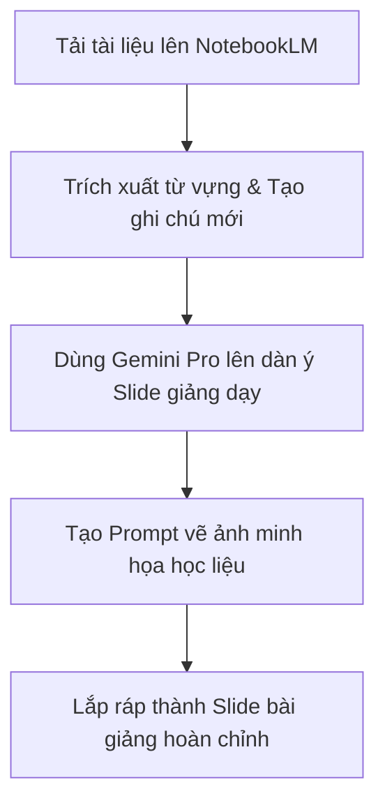

# HƯỚNG DẪN BÀI TẬP THỰC HÀNH: LIÊN KẾT NOTEBOOKLM & GEMINI PRO TRONG SƯ PHẠM TIẾNG TRUNG

**Chủ đề:** Xây dựng kho tri thức bài giảng, thiết kế Slide và hình ảnh minh họa bài học tự động.
**Đối tượng:** Giáo viên, giảng viên và học viên ngành sư phạm tiếng Trung ứng dụng AI.
**Thời lượng thực hành:** 90 - 120 phút.

---

## I. MỤC TIÊU BÀI THỰC HÀNH
Sau khi hoàn thành bài tập thực hành này, học viên có khả năng:
1. **Sử dụng thành thạo NotebookLM** để quản lý nguồn học liệu tiếng Trung, tự động hóa quy trình tóm tắt, dịch nghĩa và soạn thảo ghi chú học tập.
2. **Khai thác Gemini Pro** để kết nối tri thức từ NotebookLM, chuyển đổi văn bản thô thành kịch bản Slide giảng dạy chuyên nghiệp.
3. **Ứng dụng AI sinh ảnh** để tạo học liệu trực quan (Flashcard hình ảnh, tranh minh họa bài khóa) giúp tăng sinh động cho lớp học.

---

## II. CHUẨN BỊ CỦA HỌC VIÊN
*   Tài khoản Google (để sử dụng NotebookLM và Gemini).
*   1 file tài liệu học liệu tiếng Trung mẫu: Có thể là file PDF bài đọc, một chương giáo trình HSK, hoặc liên kết một trang web ngữ pháp tiếng Trung bất kỳ.
*   Máy tính có kết nối Internet ổn định.

---

## III. NỘI DUNG THỰC HÀNH CHI TIẾT (STEP-BY-STEP)

### BƯỚC 1: Xây dựng kho tri thức bài học trên NotebookLM (30 phút)
*   **Mục tiêu:** Tạo một "bộ não nhân tạo" chỉ chứa tài liệu tiếng Trung của bạn để tránh AI bị ảo tưởng thông tin (hallucination).
*   **Các bước thực hiện:**
    1. Truy cập vào [NotebookLM](https://notebooklm.google/).
    2. Chọn **"New Notebook" (Sổ ghi chú mới)**.
    3. Tiến hành tải lên tài liệu đã chuẩn bị (File PDF, Word, Google Doc hoặc dán đường link trang web học ngữ pháp).
    4. Nhấp vào **"Study Guide" (Hướng dẫn học tập)** do NotebookLM tự động gợi ý để xem bản tóm tắt, các câu hỏi thường gặp (FAQ) và danh sách từ khóa quan trọng của bài học.

---

### BƯỚC 2: Biên soạn tài liệu chi tiết trong Sổ ghi chú mới (30 phút)
*   **Mục tiêu:** Tận dụng tính năng **Notebook Notes (Sổ ghi chú)** để cô đọng nội dung dạy học.
*   **Các bước thực hiện:**
    1. Nhìn vào cột bên phải của NotebookLM, chọn **"New Note" (Tạo ghi chú mới)**.
    2. Đặt tên ghi chú là: `Ghi chú bài giảng: [Tên bài học]`.
    3. Tại đây, sử dụng khung chat chat với NotebookLM bằng các câu lệnh (Prompt) sau để trích xuất nội dung vào ghi chú:
        *   *Prompt 1:* `"Dựa trên tài liệu nguồn, hãy trích xuất cho tôi 10 từ vựng cốt lõi nhất của bài học này. Trình bày dạng bảng gồm: Từ chữ Hán, Phiên âm Pinyin, Từ loại, Nghĩa tiếng Việt."`
        *   *Prompt 2:* `"Hãy giải thích chi tiết 2 cấu trúc ngữ pháp khó nhất xuất hiện trong tài liệu này kèm theo 3 ví dụ thực tế cho mỗi cấu trúc."`
    4. Nhấn nút **"Pin to note" (Ghim vào ghi chú)** ở mỗi câu trả lời của AI để lưu các nội dung này trực tiếp vào Sổ ghi chú của bạn.

---

### BƯỚC 3: Liên kết với Gemini Pro để thiết kế Slide giảng dạy (30 phút)
*   **Mục tiêu:** Chuyển đổi toàn bộ nội dung ghi chú đã chắt lọc ở Bước 2 thành một bài giảng Slide cấu trúc sư phạm chuẩn mực.
*   **Các bước thực hiện:**
    1. Sao chép (Copy) toàn bộ nội dung ghi chú học tập đã chuẩn bị ở Bước 2 trên NotebookLM.
    2. Mở [Gemini](https://gemini.google/) (hoặc bảng chat Gemini Advanced/Pro).
    3. Sử dụng Prompt sau để tạo kịch bản thiết kế Slide:
        > **Prompt thiết kế Slide:**
        > *"Bạn là một chuyên gia thiết kế bài giảng sư phạm. Tôi sẽ gửi cho bạn nội dung kiến thức bài học tiếng Trung dưới đây. Hãy chuyển đổi nó thành một kịch bản thiết kế Slide giảng dạy chi tiết theo từng trang (tối thiểu 8 slide). Mỗi slide cần chỉ rõ:
        > - Tiêu đề slide (Slide Title)
        > - Nội dung hiển thị dạng Bullet points (ngắn gọn, trực quan)
        > - Ý tưởng thiết kế hình ảnh/icon minh họa cho slide đó (Visual Ideas)"*
    4. Dán nội dung đã copy từ NotebookLM vào bên dưới Prompt và gửi đi. Học viên lưu lại kịch bản Slide này ra một file Word hoặc PowerPoint.

---

### BƯỚC 4: Sáng tạo hình ảnh minh họa học liệu trực quan (20 phút)
*   **Mục tiêu:** Tạo ra các hình ảnh minh họa chân thực để làm Flashcard hoặc chèn thẳng vào slide giảng dạy.
*   **Các bước thực hiện:**
    1. Lấy ý tưởng thiết kế hình ảnh từ kịch bản Slide ở Bước 3.
    2. Sử dụng tính năng sinh ảnh trực tiếp của Gemini (hoặc Imagen 3 tích hợp) để tạo hình ảnh minh họa chất lượng cao bằng các Prompt tiếng Anh hoặc tiếng Việt mô tả rõ nét.
    3. **Ví dụ Prompt tạo hình ảnh học liệu:**
        *   *Prompt:* `"Tạo một hình ảnh 3D phong cách hoạt hình Pixar dễ thương, minh họa một học sinh đang vui mừng cầm cốc trà sữa trân châu trước cổng trường học Trung Quốc, màu sắc tươi sáng, sắc nét, không có chữ viết trên ảnh."`
    4. Tải các hình ảnh sinh ra về máy và chèn vào slide bài học tương ứng.

---

## IV. TIÊU CHÍ NGHIỆM THU SẢN PHẨM THỰC HÀNH
Cuối buổi học, mỗi học viên hoặc nhóm học viên sẽ nộp/trình diễn một đường link thư mục Drive bao gồm:
1. **Link NotebookLM** đã được thiết lập nguồn tài liệu và có ít nhất 2 ghi chú được ghim (Bảng từ vựng + Giải thích ngữ pháp).
2. **File kịch bản Slide** chi tiết do Gemini Pro xây dựng.
3. **Bộ slide PowerPoint hoặc Google Slides** đã được thiết kế hoàn thiện, có tích hợp các hình ảnh minh họa sinh động được tạo bằng AI.

---

## V. LƯU Ý KHI GIẢNG DẠY CHO GIÁO VIÊN
*   **Mẹo sư phạm:** Hãy nhấn mạnh cho học viên biết rằng **NotebookLM đóng vai trò là "Kho lưu trữ & Phân tích thông tin chính xác"**, trong khi **Gemini Pro đóng vai trò là "Nhà sáng tạo nội dung đa phương tiện"**. Sự kết hợp của bộ đôi này sẽ giúp việc soạn giảng vừa chuẩn xác về kiến thức chuyên môn vừa thu hút về hình thức thể hiện.
