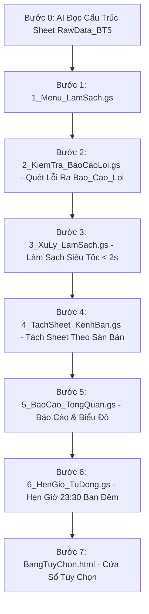

# HƯỚNG DẪN THỰC HÀNH BÀI 5: TỰ ĐỘNG KIỂM TRA VÀ LÀM SẠCH DỮ LIỆU LỚN
## XỬ LÝ HƠN 1.000 DÒNG DỮ LIỆU TRONG DƯỚI 2 GIÂY TRÊN GOOGLE SHEETS

---

### 1. TÌNH HUỐNG THỰC TẾ TRONG DOANH NGHIỆP

* **Bối cảnh:** Bạn là nhân viên văn phòng, kế toán hoặc quản lý đơn hàng. Mỗi ngày hệ thống xuất ra danh sách hơn 1.000 đơn hàng đổ về từ các sàn Shopee, Lazada, TikTok Shop và Website tại sheet `RawData_BT5`.
* **Khó khăn khi làm thủ công:** 
  - Mã đơn hàng bị để trống hoặc bị trùng lặp do khách bấm mua nhiều lần.
  - Số điện thoại bị mất số 0 ở đầu do định dạng số của Excel, hoặc dính dấu chấm, khoảng trắng (ví dụ: `0903.123.456`, `988123456`).
  - Họ tên viết hoa và viết thường tùy tiện, có nhiều khoảng trắng thừa.
  - Doanh thu có dòng bị âm hoặc bằng 0 do lỗi hệ thống.
  - Dùng các hàm Excel thủ công để lọc từng dòng mất cả buổi chiều, rất dễ làm đơ máy và có nguy cơ làm hỏng dữ liệu gốc.
* **Giải pháp tự động hóa:**
  - Áp dụng mô hình **1 Bước = 1 File Độc Lập**.
  - Kiểm tra an toàn trước: Quét dữ liệu thô và xuất danh sách các dòng lỗi ra sheet riêng `Bao_Cao_Loi` để kiểm tra đối soát trước, không sửa đè lên dữ liệu gốc.
  - Xử lý siêu tốc: Gom dữ liệu vào bộ nhớ máy để lọc trùng, sửa tên, sửa số điện thoại và lưu sang sheet `DataCleaned_BT5` trong **dưới 2 giây**.
  - Tự động tách đơn hàng về các sheet riêng cho từng sàn (`San_Shopee`, `San_Lazada`, `San_TikTok Shop`, `San_Website`).
  - Tạo trang **Báo Cáo Tổng Quan** hiển thị các con số thống kê và cài đặt hẹn giờ tự chạy lúc 23:30 mỗi đêm.

---

### 2. DANH SÁCH CÁC TỆP MÃ NGUỒN ĐỘC LẬP TRONG BÀI

```
Hệ Thống Làm Sạch Dữ Liệu
├── 1_Menu_LamSach.gs       (Bước 1: Tạo menu tiện ích trên thanh công cụ)
├── 2_KiemTra_BaoCaoLoi.gs   (Bước 2: Quét kiểm tra dữ liệu và lập danh sách lỗi ra sheet Bao_Cao_Loi)
├── 3_XuLy_LamSach.gs       (Bước 3: Làm sạch dữ liệu siêu tốc dưới 2 giây ra sheet DataCleaned_BT5)
├── 4_TachSheet_KenhBan.gs   (Bước 4: Tự động tách dữ liệu thành các sheet theo từng kênh bán)
├── 5_BaoCao_TongQuan.gs     (Bước 5: Tạo trang báo cáo tổng quan và biểu đồ thống kê)
├── 6_HenGio_TuDong.gs      (Bước 6: Hẹn giờ tự động chạy làm sạch lúc 23:30 mỗi đêm)
└── BangTuyChon.html         (Bước 7: Cửa sổ tùy chọn các quy tắc làm sạch dữ liệu)
```

---

### 3. LỘ TRÌNH 8 BƯỚC THỰC HÀNH CHI TIẾT



---

#### BƯỚC 0: AI ĐỌC VÀ NẮM RÕ SHEET `RawData_BT5`
* **Mục tiêu:** Cho AI đọc đường link Google Sheets để hiểu cấu trúc 6 cột dữ liệu thô và nhận diện các dạng lỗi có sẵn trước khi tạo mã.
* **Câu Prompt:**
```text
[YÊU CẦU ĐỌC VÀ HIỂU BẢNG TÍNH]:
Link Google Sheets: [Dán đường link bảng tính của bạn vào đây]

Tôi đang có một bảng tính chứa dữ liệu đơn hàng tại sheet "RawData_BT5".
Nhiệm vụ của bạn ở bước này:
1. Hãy truy cập vào link bảng tính và đọc kỹ trang tính "RawData_BT5".
2. Xác định rõ: Tên 6 cột dữ liệu (từ Cột A đến Cột F), dòng tiêu đề (Dòng 3) và dòng bắt đầu có dữ liệu thực tế (Dòng 4 trở đi).
3. Chỉ ra sơ bộ các dạng dữ liệu chưa chuẩn hiện có (mã để trống, mã trùng lặp, số điện thoại có dấu chấm hoặc thiếu số 0, họ tên thừa khoảng trắng, doanh thu âm).
4. Tóm tắt ngắn gọn cấu trúc để xác nhận bạn đã hiểu đúng trước khi làm tiếp.

Lưu ý: Chưa viết bất kỳ dòng code nào ở bước này.
```

---

#### BƯỚC 1: TẠO FILE `1_Menu_LamSach.gs`
* **Mục tiêu:** Tạo thanh menu điều khiển tiện ích trên Google Sheets.
* **Câu Prompt:**
```text
[YÊU CẦU NGHIỆP VỤ - FILE 1_Menu_LamSach.gs]:
Dựa vào bảng tính đã phân tích ở Bước 0, hãy viết mã cho file độc lập "1_Menu_LamSach.gs" chứa hàm onOpen() để tạo Menu "Làm Sạch Dữ Liệu" trên thanh công cụ Google Sheets gồm các mục:

1. 1. Xem Báo Cáo Tổng Quan (gọi hàm khoiTaoBaoCaoTongQuan)
   [Đường gạch ngang phân cách]
2. 2. Kiểm Tra Dữ Liệu (Xuất Sheet Báo Cáo Lỗi) (gọi hàm chayKiemTraBaoCaoLoi)
3. 3. Chạy Làm Sạch Dữ Liệu (Dưới 2 Giây) (gọi hàm chayLamSachDuLieuNhanh)
4. 4. Tách Dữ Liệu Theo Kênh Bán Hàng (gọi hàm tachDuLieuTheoKenhBan)
   [Đường gạch ngang phân cách]
5. 5. Tùy Chọn Quy Tắc Làm Sạch (gọi hàm moCuaSoTuyChon mở file 'BangTuyChon' kích thước 680x540px)
   [Đường gạch ngang phân cách]
6. 6. Bật Tự Động Chạy Hàng Đêm (23:30) (gọi hàm caiDatHenGioHangDem)
7. 7. Tắt Tự Động Chạy Hàng Đêm (gọi hàm huyHenGioHangDem)
   [Đường gạch ngang phân cách]
8. 8. Hướng Dẫn Sử Dụng (hiện hộp thoại tóm tắt quy trình 5 bước dễ hiểu)

[YÊU CẦU ĐẦU RA]:
- Xuất khối mã hoàn chỉnh cho file "1_Menu_LamSach.gs", không sử dụng bất kỳ biểu tượng cảm xúc hoặc icon nào trong menu và thông báo.
```

---

#### BƯỚC 2: TẠO FILE `2_KiemTra_BaoCaoLoi.gs`
* **Mục tiêu:** Kiểm tra dữ liệu thô và xuất danh sách lỗi ra sheet `Bao_Cao_Loi` để đối soát an toàn.
* **Câu Prompt:**
```text
[YÊU CẦU NGHIỆP VỤ - FILE 2_KiemTra_BaoCaoLoi.gs]:
Hãy viết toàn bộ mã nguồn cho file độc lập "2_KiemTra_BaoCaoLoi.gs" chứa hàm chayKiemTraBaoCaoLoi() để kiểm tra dữ liệu thô và xuất danh sách lỗi ra sheet riêng đối soát:

1. Đọc toàn bộ dữ liệu từ sheet "RawData_BT5" (từ dòng 4 trở đi) vào bộ nhớ máy 1 lần bằng getValues().
2. Kiểm tra chi tiết từng dòng và ghi nhận các lỗi:
   - Mã đơn hàng bị để trống hoặc bị trùng lặp (giữ lại mã đầu tiên, đánh dấu các mã trùng sau).
   - Doanh thu nhỏ hơn hoặc bằng 0.
   - Số điện thoại có chứa dấu chấm, khoảng trắng, gạch ngang hoặc chỉ có 9 chữ số (thiếu số 0 đầu).
   - Họ tên khách hàng có chứa nhiều khoảng trắng thừa hoặc viết hoa thường lộn xộn.
3. Tạo mới hoặc làm sạch trang tính tên "Bao_Cao_Loi" nằm ở vị trí thứ 2:
   - Hàng 1: Dòng chữ in đậm "BẢNG BÁO CÁO KIỂM TRA LỖI DỮ LIỆU" nền xanh đậm #1B365D, chữ trắng cỡ 14.
   - Hàng 2: Dòng tóm tắt ngắn gọn: Tổng số dòng kiểm tra, dòng đạt chuẩn, số mã để trống, mã trùng, doanh thu sai, số điện thoại cần sửa, họ tên cần sửa.
   - Hàng 4: Tiêu đề 8 cột: Dòng Lỗi, Mã Giao Dịch, Tên Khách Hàng, Số Điện Thoại, Kênh Bán, Doanh Thu, Phân Loại Lỗi (Lỗi Cần Loại Bỏ / Tự Động Sửa Được), Chi Tiết Lỗi Cụ Thể.
4. Ghi toàn bộ danh sách các dòng có lỗi xuống sheet "Bao_Cao_Loi" bằng setValues() và định dạng số tiền dễ nhìn.
5. Hiện hộp thoại thông báo đã kiểm tra xong và chuyển màn hình sang sheet "Bao_Cao_Loi".

[YÊU CẦU ĐẦU RA]:
- Xuất khối mã hoàn chỉnh cho file "2_KiemTra_BaoCaoLoi.gs", tuyệt đối không chỉnh sửa hay xóa dòng nào ở dữ liệu gốc RawData_BT5. Không sử dụng icon trong tiêu đề.
```

---

#### BƯỚC 3: TẠO FILE `3_XuLy_LamSach.gs`
* **Mục tiêu:** Làm sạch hơn 1.000 dòng dữ liệu trong dưới 2 giây, xóa trùng, sửa tên, sửa số điện thoại, ghi sang sheet `DataCleaned_BT5`.
* **Câu Prompt:**
```text
[YÊU CẦU NGHIỆP VỤ - FILE 3_XuLy_LamSach.gs]:
Hãy viết mã cho file độc lập "3_XuLy_LamSach.gs" chứa hàm chayLamSachDuLieuNhanh() để tự động làm sạch hơn 1.000 dòng dữ liệu trong dưới 2 giây:

1. Đọc dữ liệu từ sheet "RawData_BT5" vào bộ nhớ máy 1 lần bằng getValues().
2. Các quy tắc làm sạch dữ liệu tự động:
   - Loại bỏ các dòng có mã đơn hàng để trống.
   - Loại bỏ các dòng bị trùng lặp mã đơn hàng (chỉ giữ lại bản ghi xuất hiện đầu tiên).
   - Loại bỏ các dòng có doanh thu nhỏ hơn hoặc bằng 0.
   - Chuẩn hóa họ tên: Tạo hàm phụ chuanHoaTenTiengViet xóa khoảng trắng thừa và viết hoa chữ cái đầu của mỗi từ (Ví dụ: "  nguyễn  văn an " đổi thành "Nguyễn Văn An").
   - Chuẩn hóa số điện thoại: Xóa hết dấu chấm, khoảng trắng, gạch ngang và tự động thêm số "0" vào đầu nếu số điện thoại chỉ có 9 chữ số.
   - Giữ nguyên định dạng ngày tháng dd/MM/yyyy.
   - Cột Trạng Thái ghi giá trị "Hợp Lệ".
3. Tạo mới hoặc làm sạch trang tính tên "DataCleaned_BT5":
   - Hàng 1: Tiêu đề "BẢNG DỮ LIỆU ĐÃ ĐƯỢC LÀM SẠCH VÀ CHUẨN HÓA" nền xanh đậm #1B365D, chữ trắng in đậm.
   - Hàng 3: Tiêu đề 7 cột (Mã Giao Dịch, Tên Khách Hàng, Số Điện Thoại, Kênh Bán, Doanh Thu, Ngày Tạo, Trạng Thái) nền xanh #005A9C, chữ trắng in đậm.
   - Ghi toàn bộ dữ liệu sạch từ dòng 4 trở đi 1 lần bằng setValues().
   - Định dạng cột Doanh Thu '#,##0', căn giữa cột Mã, Số điện thoại, Ngày tạo và tự động chỉnh độ rộng cột vừa vặn.
4. Đo thời gian thực hiện bằng startTime và hiện hộp thoại thông báo: Thời gian xử lý xong (giây), Số dòng ban đầu, Số dòng sạch thu được, Số dòng đã loại bỏ (do trùng mã, do mã trống, do doanh thu <= 0) và Số điện thoại đã tự thêm số 0.

[YÊU CẦU ĐẦU RA]:
- Xuất khối mã hoàn chỉnh cho file "3_XuLy_LamSach.gs", không dùng icon trong chuỗi thông báo.
```

---

#### BƯỚC 4: TẠO FILE `4_TachSheet_KenhBan.gs`
* **Mục tiêu:** Tự động tách dữ liệu sạch thành các sheet riêng cho từng sàn (`San_Shopee`, `San_Lazada`, `San_TikTok Shop`, `San_Website`).
* **Câu Prompt:**
```text
[YÊU CẦU NGHIỆP VỤ - FILE 4_TachSheet_KenhBan.gs]:
Hãy viết mã cho file độc lập "4_TachSheet_KenhBan.gs" chứa hàm tachDuLieuTheoKenhBan() để tự động chia đơn hàng về các sheet riêng cho từng người phụ trách:

1. Nguồn dữ liệu: Đọc từ trang tính "DataCleaned_BT5" đã được làm sạch ở Bước 3 (nếu chưa có sheet thì hiện thông báo nhắc người dùng bấm Bước 3 trước).
2. Tự động gom nhóm các dòng đơn hàng theo Kênh Bán (Cột D: Shopee, Lazada, TikTok Shop, Website...).
3. Tự động tạo hoặc làm mới từng sheet mang tên theo sàn:
   - Tên sheet: "San_Shopee", "San_Lazada", "San_TikTok Shop", "San_Website".
   - Dòng 1: Tiêu đề "DANH SÁCH ĐƠN HÀNG: [TÊN SÀN]" nền màu đặc trưng (Shopee cam #EE4D2D, Lazada xanh #0f146d, TikTok Shop #1e293b, Website xanh dương #2563eb).
   - Ghi danh sách đơn của từng sàn vào sheet tương ứng, định dạng số tiền '#,##0' và căn lề đẹp mắt.
4. Hiện hộp thoại thông báo tổng kết số lượng đơn hàng đã chia về từng sàn.

[YÊU CẦU ĐẦU RA]:
- Xuất khối mã hoàn chỉnh cho file "4_TachSheet_KenhBan.gs", không chứa icon.
```

---

#### BƯỚC 5: TẠO FILE `5_BaoCao_TongQuan.gs`
* **Mục tiêu:** Tạo trang báo cáo tổng quan gồm 4 thẻ con số và 2 biểu đồ thống kê cơ cấu doanh thu.
* **Câu Prompt:**
```text
[YÊU CẦU NGHIỆP VỤ - FILE 5_BaoCao_TongQuan.gs]:
Hãy viết toàn bộ mã nguồn cho file độc lập "5_BaoCao_TongQuan.gs" chứa hàm khoiTaoBaoCaoTongQuan() để tạo trang báo cáo tổng quan:

1. Khởi tạo trang "Bao_Cao_Tong_Quan" ở vị trí đầu tiên (Sheet 1):
   - Hàng 1: Dòng chữ lớn "BÁO CÁO TỔNG QUAN CHẤT LƯỢNG DỮ LIỆU VÀ DOANH THU ĐƠN HÀNG" nền xanh đậm #1B365D, chữ trắng in đậm cỡ 18.
   - Hàng 3: Dòng ngày giờ cập nhật gần nhất.
2. 4 ô thẻ con số tổng quan (Hàng 5 đến Hàng 7):
   - Ô 1 (Cột A-B): TỔNG DÒNG BAN ĐẦU (số dòng nhận được từ RawData_BT5).
   - Ô 2 (Cột C-D): DỮ LIỆU SẠCH HỢP LỆ (số dòng đạt chuẩn ở DataCleaned_BT5, màu xanh lá #059669).
   - Ô 3 (Cột E-F): SỐ BẢN GHI ĐÃ LOẠI BỎ (số dòng lỗi đã lọc ra, màu đỏ #dc2626).
   - Ô 4 (Cột G-H): TỶ LỆ DỮ LIỆU ĐẠT CHUẨN (tính theo phần trăm %, màu tím #7c3aed).
3. Trang tính phụ "Bang_Phu_Thong_Ke" (giữ hiển thị bình thường để biểu đồ đọc dữ liệu, không ẩn tab):
   - Bảng 1: Doanh thu của 4 kênh bán (Shopee, Lazada, TikTok Shop, Website) dùng công thức SUMIFS dấu chấm phẩy ';'.
   - Bảng 2: Thống kê số lượng các dạng lỗi từ sheet Bao_Cao_Loi dùng công thức COUNTIF dấu chấm phẩy ';'.
4. Tự động vẽ 2 biểu đồ đặt ở Hàng 9:
   - Biểu đồ tròn: "CƠ CẤU DOANH THU THEO KÊNH BÁN" (đặt tại A9, kích thước 490x360px).
   - Biểu đồ cột: "CÁC DẠNG LỖI TÌM THẤY TRONG DỮ LIỆU BAN ĐẦU" (đặt tại E9, kích thước 560x360px, cột màu đỏ).

[YÊU CẦU ĐẦU RA]:
- Xuất khối mã hoàn chỉnh cho file "5_BaoCao_TongQuan.gs", không chứa icon trong tiêu đề hay nhãn biểu đồ.
```

---

#### BƯỚC 6: TẠO FILE `6_HenGio_TuDong.gs`
* **Mục tiêu:** Cài đặt hẹn giờ tự động chạy làm sạch và cập nhật báo cáo lúc 23:30 mỗi đêm.
* **Câu Prompt:**
```text
[YÊU CẦU NGHIỆP VỤ - FILE 6_HenGio_TuDong.gs]:
Hãy viết mã cho file độc lập "6_HenGio_TuDong.gs" để cài đặt hẹn giờ tự động chạy hàng ngày mà không cần mở máy tính:

1. Hàm caiDatHenGioHangDem():
   - Tự động kiểm tra và xóa lịch hẹn giờ cũ nếu có để tránh chạy lặp lại.
   - Cài đặt hẹn giờ chạy hàm chayTuDongBanDem() lặp lại mỗi ngày vào khung giờ 23:00 - 24:00 đêm.
   - Hiện thông báo: "ĐÃ BẬT HẸN GIỜ TỰ ĐỘNG! Hệ thống sẽ tự động làm sạch và cập nhật báo cáo vào lúc 23:30 mỗi đêm."
2. Hàm huyHenGioHangDem():
   - Tắt lịch hẹn giờ chạy tự động.
3. Hàm điều phối chayTuDongBanDem():
   - Tự động gọi lần lượt 3 công việc: chayLamSachDuLieuNhanh(), tachDuLieuTheoKenhBan() và khoiTaoBaoCaoTongQuan().

[YÊU CẦU ĐẦU RA]:
- Xuất khối mã hoàn chỉnh cho file "6_HenGio_TuDong.gs", không dùng icon.
```

---

#### BƯỚC 7: TẠO FILE `BangTuyChon.html`
* **Mục tiêu:** Cửa sổ tùy chọn giao diện sạch sẽ, thân thiện cho người dùng văn phòng.
* **Câu Prompt:**
```text
Hãy thiết kế mã nguồn cho tệp giao diện HTML "BangTuyChon.html" hiển thị cửa sổ tùy chọn cho người dùng văn phòng:

1. Giao diện:
   - Sử dụng thư viện Bootstrap 5 qua CDN.
   - Thiết kế trang nhã, màu xanh đậm #1B365D làm điểm nhấn, phông chữ hệ thống rõ ràng, dễ đọc, không dùng icon hay hình trang trí rườm rà.
2. Nội dung các tùy chọn (dạng ô tích chọn checkbox):
   - Tiêu đề: "Tùy Chọn Quy Tắc Làm Sạch Dữ Liệu"
   - 5 ô tích chọn có giải thích ngắn gọn bằng tiếng Việt:
     1. Xóa bỏ mã đơn hàng bị trùng lặp (Tự động phát hiện và chỉ giữ lại đơn hàng xuất hiện lần đầu tiên) [Mặc định: Bật]
     2. Tự động sửa chuẩn số điện thoại (Bỏ dấu chấm, khoảng trắng thừa và tự thêm số 0 vào đầu nếu bị thiếu) [Mặc định: Bật]
     3. Viết hoa chữ cái đầu cho họ và tên (Xóa khoảng trắng thừa và chuẩn hóa đẹp mắt, ví dụ: Nguyễn Văn An) [Mặc định: Bật]
     4. Loại bỏ đơn hàng có doanh thu nhỏ hơn hoặc bằng 0 (Lọc bỏ triệt để các đơn hàng lỗi doanh thu âm hoặc bằng 0) [Mặc định: Bật]
     5. Tự động tách riêng từng sheet theo kênh bán (Tạo các trang riêng cho Shopee, Lazada, TikTok Shop, Website) [Mặc định: Bật]
   - Nút bấm to, rõ ràng: "Bắt Đầu Xử Lý Làm Sạch Dữ Liệu (Dưới 2 Giây)" màu xanh đậm.
3. Hoạt động:
   - Khi bấm nút, nút hiển thị chữ "Đang xử lý dữ liệu..." và gọi hàm chayLamSachDuLieuNhanh().
   - Khi hoàn thành, tự động đóng cửa sổ lại bằng google.script.host.close().
```

---

### 4. DANH SÁCH KIỂM TRA NGHIỆM THU

- [ ] Bảng tính có sheet `RawData_BT5` chứa hơn 1.000 dòng log đơn hàng bắt đầu từ dòng 4.
- [ ] Đã tạo đủ 7 file độc lập trong trình soạn thảo Apps Script: `1_Menu_LamSach.gs`, `2_KiemTra_BaoCaoLoi.gs`, `3_XuLy_LamSach.gs`, `4_TachSheet_KenhBan.gs`, `5_BaoCao_TongQuan.gs`, `6_HenGio_TuDong.gs`, `BangTuyChon.html`.
- [ ] Menu `Làm Sạch Dữ Liệu` xuất hiện trên thanh công cụ sau khi mở lại bảng tính.
- [ ] Bấm mục `2. Kiểm Tra Dữ Liệu` tạo thành công sheet `Bao_Cao_Loi` liệt kê danh sách các dòng lỗi chi tiết.
- [ ] Bấm mục `3. Chạy Làm Sạch Dữ Liệu` tạo sheet `DataCleaned_BT5` trong dưới 2 giây, không còn đơn trùng, số điện thoại có đủ 10 số có số 0 đầu, họ tên viết hoa chuẩn.
- [ ] Bấm mục `4. Tách Dữ Liệu Theo Kênh Bán Hàng` tự động sinh 4 sheet `San_Shopee`, `San_Lazada`, `San_TikTok Shop`, `San_Website`.
- [ ] Trang `Bao_Cao_Tong_Quan` hiển thị đúng 4 thẻ con số thống kê cùng 2 biểu đồ tròn và cột không bị lỗi.
- [ ] Bật thành công hẹn giờ tự động chạy lúc 23:30 mỗi đêm.
