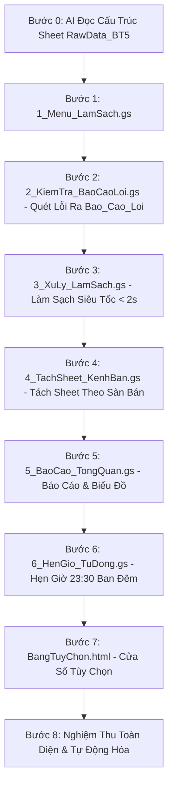

# KẾ HOẠCH THỰC HÀNH CHUẨN BÀI 5: TỰ ĐỘNG KIỂM TRA VÀ LÀM SẠCH DỮ LIỆU LỚN
## KIẾN TRÚC VI BƯỚC ĐỘC LẬP (1 BƯỚC = 1 FILE DUY NHẤT)

> Dựa trên file dữ liệu `bai_tap_5_raw_data_1000_rows.csv` (sheet `RawData_BT5`), học viên sẽ xây dựng một ứng dụng Kiểm Tra Và Làm Sạch Dữ Liệu Đơn Hàng hoàn chỉnh. Mỗi bước chỉ tạo đúng 1 file trong Google Apps Script Editor và bấm chạy nghiệm thu ngay lập tức!

---

## SƠ ĐỒ TOÀN BỘ CÁC FILE ĐỘC LẬP TRONG DỰ ÁN

```
Hệ Thống Làm Sạch Dữ Liệu
├── 1_Menu_LamSach.gs       (Bước 1: Tạo menu tiện ích trên thanh công cụ)
├── 2_KiemTra_BaoCaoLoi.gs   (Bước 2: Quét kiểm tra dữ liệu và lập danh sách lỗi ra sheet Bao_Cao_Loi)
├── 3_XuLy_LamSach.gs       (Bước 3: Làm sạch dữ liệu siêu tốc dưới 2 giây ra sheet DataCleaned_BT5)
├── 4_TachSheet_KenhBan.gs   (Bước 4: Tự động tách dữ liệu thành các sheet theo từng kênh bán)
├── 5_BaoCao_TongQuan.gs     (Bước 5: Tạo trang báo cáo tổng quan và biểu đồ thống kê)
├── 6_HenGio_TuDong.gs      (Bước 6: Hẹn giờ tự động chạy làm sạch lúc 23:30 mỗi đêm)
└── BangTuyChon.html         (Bước 7: Cửa sổ tùy chọn các quy tắc làm sạch dữ liệu)
```

---

## LỘ TRÌNH 8 BƯỚC THỰC HÀNH CHI TIẾT (PROMPT RÚT GỌN CHO DÂN VĂN PHÒNG)



---

### BƯỚC 0: YÊU CẦU AI TỰ ĐỌC & NẮM RÕ SHEET `RawData_BT5`

* **Mục tiêu:** Cho AI đọc link Google Sheets để hiểu cấu trúc các cột và các lỗi có sẵn.
* **Câu Prompt Bước 0:**

```text
Link Google Sheets: [Dán link bảng tính của bạn vào đây]

Tôi có bảng dữ liệu đơn hàng ở sheet "RawData_BT5" (dữ liệu từ dòng 4 trở đi).
Bạn hãy đọc sheet này và chỉ ra cho tôi các cột dữ liệu cùng các lỗi sai phổ biến đang có trong bảng (như mã bị trống, mã bị trùng, số điện thoại sai định dạng, họ tên thừa khoảng trắng, doanh thu âm).
Chưa cần viết code ở bước này.
```

---

### BƯỚC 1: TẠO FILE `1_Menu_LamSach.gs` (MENU TIỆN ÍCH)

* **Thao tác:** Mở Tiện ích mở rộng ➔ Apps Script ➔ Bấm dấu (+) chọn Script ➔ Đặt tên file là `1_Menu_LamSach.gs` ➔ Dán mã AI sinh ra vào.
* **Câu Prompt Bước 1:**

```text
Hãy viết mã cho file "1_Menu_LamSach.gs" để tạo một thanh menu tên "Làm Sạch Dữ Liệu" trên Google Sheets gồm các mục:
1. 1. Xem Báo Cáo Tổng Quan
2. 2. Kiểm Tra Dữ Liệu (Xuất Sheet Báo Cáo Lỗi)
3. 3. Chạy Làm Sạch Dữ Liệu (Dưới 2 Giây)
4. 4. Tách Dữ Liệu Theo Kênh Bán Hàng
5. 5. Tùy Chọn Quy Tắc Làm Sạch (mở file BangTuyChon.html)
6. 6. Bật Tự Động Chạy Hàng Đêm (23:30)
7. 7. Tắt Tự Động Chạy Hàng Đêm
8. 8. Hướng Dẫn Sử Dụng
Lưu ý: Không dùng biểu tượng cảm xúc trong menu và thông báo.
```

---

### BƯỚC 2: TẠO FILE `2_KiemTra_BaoCaoLoi.gs` (BƯỚC KIỂM TRA LỖI AN TOÀN)

* **Thao tác:** Bấm dấu (+) chọn Script ➔ Đặt tên file là `2_KiemTra_BaoCaoLoi.gs` ➔ Dán mã quét kiểm tra an toàn xuất ra sheet `Bao_Cao_Loi`.
* **Câu Prompt Bước 2:**

```text
Hãy viết mã cho file "2_KiemTra_BaoCaoLoi.gs":
Quét toàn bộ dữ liệu ở sheet "RawData_BT5" (từ dòng 4 trở đi) và xuất danh sách các dòng bị lỗi sang sheet mới tên "Bao_Cao_Loi" để tôi đối soát:
- Tìm các lỗi: mã đơn bị để trống, mã đơn bị trùng lặp, doanh thu nhỏ hơn hoặc bằng 0, số điện thoại có dấu chấm hoặc mất số 0 đầu, họ tên viết hoa lộn xộn hoặc thừa khoảng trắng.
- Liệt kê rõ: Dòng lỗi, Mã giao dịch, Tên khách hàng, Số điện thoại, Kênh bán, Doanh thu, Phân loại lỗi và Chi tiết lỗi.
- Có một dòng tóm tắt số lượng lỗi ở đầu sheet.
- Giữ nguyên dữ liệu gốc không chỉnh sửa và không dùng biểu tượng cảm xúc.
```

---

### BƯỚC 3: TẠO FILE `3_XuLy_LamSach.gs` (LÀM SẠCH DỮ LIỆU SIÊU TỐC DƯỚI 2 GIÂY)

* **Thao tác:** Bấm dấu (+) chọn Script ➔ Đặt tên file là `3_XuLy_LamSach.gs` ➔ Dán mã xử lý làm sạch dữ liệu trong 2 giây ra sheet `DataCleaned_BT5`.
* **Câu Prompt Bước 3:**

```text
Hãy viết mã cho file "3_XuLy_LamSach.gs":
Tự động làm sạch toàn bộ dữ liệu từ sheet "RawData_BT5" và lưu kết quả sang sheet mới tên "DataCleaned_BT5":
- Xóa bỏ các dòng có mã đơn để trống, mã đơn bị trùng lặp hoặc doanh thu nhỏ hơn hay bằng 0.
- Sửa họ tên: viết hoa chữ cái đầu của mỗi từ và xóa các khoảng trắng thừa.
- Sửa số điện thoại: bỏ các dấu chấm, khoảng trắng thừa và tự thêm số 0 vào đầu nếu bị thiếu.
- Yêu cầu xử lý thật nhanh trong dưới 2 giây để không làm đơ bảng tính.
- Báo cáo số dòng ban đầu, số dòng sạch thu được và số dòng đã lọc bỏ. Không dùng biểu tượng cảm xúc.
```

---

### BƯỚC 4: TẠO FILE `4_TachSheet_KenhBan.gs` (TỰ ĐỘNG TÁCH SHEET THEO KÊNH BÁN HÀNG)

* **Thao tác:** Bấm dấu (+) chọn Script ➔ Đặt tên file là `4_TachSheet_KenhBan.gs` ➔ Dán mã tự động chia tách dữ liệu sạch thành các sheet từng sàn.
* **Câu Prompt Bước 4:**

```text
Hãy viết mã cho file "4_TachSheet_KenhBan.gs":
Đọc dữ liệu từ sheet "DataCleaned_BT5" và tự động tách các đơn hàng ra từng sheet riêng theo cột Kênh Bán (gồm Shopee, Lazada, TikTok Shop, Website). Mỗi sheet có màu tiêu đề riêng để phân biệt và không dùng biểu tượng cảm xúc.
```

---

### BƯỚC 5: TẠO FILE `5_BaoCao_TongQuan.gs` (TẠO TRANG BÁO CÁO VÀ BIỂU ĐỒ THỐNG KÊ)

* **Thao tác:** Bấm dấu (+) chọn Script ➔ Đặt tên file là `5_BaoCao_TongQuan.gs` ➔ Dán mã tạo 4 thẻ con số tổng quan và 2 biểu đồ thống kê.
* **Câu Prompt Bước 5:**

```text
Hãy viết mã cho file "5_BaoCao_TongQuan.gs":
Tạo trang "Bao_Cao_Tong_Quan" ở đầu bảng tính:
- Hiển thị 4 ô số liệu lớn: Tổng dòng ban đầu, Dữ liệu sạch hợp lệ, Số dòng đã loại bỏ, Tỷ lệ dữ liệu đạt chuẩn (%).
- Vẽ 2 biểu đồ: một biểu đồ tròn thể hiện cơ cấu doanh thu theo kênh bán và một biểu đồ cột phân loại các dạng lỗi tìm thấy.
Không dùng biểu tượng cảm xúc trong tiêu đề hoặc biểu đồ.
```

---

### BƯỚC 6: TẠO FILE `6_HenGio_TuDong.gs` (HẸN GIỜ TỰ ĐỘNG CHẠY LÚC 23:30 MỖI ĐÊM)

* **Thao tác:** Bấm dấu (+) chọn Script ➔ Đặt tên file là `6_HenGio_TuDong.gs` ➔ Dán mã cài đặt hẹn giờ tự động hàng đêm.
* **Câu Prompt Bước 6:**

```text
Hãy viết mã cho file "6_HenGio_TuDong.gs":
Cài đặt tính năng tự động chạy làm sạch dữ liệu, tách sheet và cập nhật báo cáo vào lúc 23:30 mỗi đêm mà tôi không cần phải mở máy tính. Có cả hàm để tắt hẹn giờ khi cần.
```

---

### BƯỚC 7: TẠO FILE `BangTuyChon.html` (CỬA SỔ TÙY CHỌN QUY TẮC LÀM SẠCH)

* **Thao tác:** Bấm dấu (+) chọn HTML ➔ Đặt tên file là `BangTuyChon.html` ➔ Dán mã giao diện cửa sổ tùy chọn sạch sẽ, dễ nhìn.
* **Câu Prompt Bước 7:**

```text
Hãy tạo file giao diện "BangTuyChon.html":
Hiển thị một cửa sổ popup đơn giản, có các ô tích chọn để tôi có thể bật hoặc tắt:
1. Xóa mã đơn trùng lặp
2. Tự động sửa số điện thoại
3. Viết hoa chữ cái đầu cho họ tên
4. Loại bỏ đơn có doanh thu nhỏ hơn hoặc bằng 0
5. Tự động tách sheet theo kênh bán
Phía dưới có nút bấm "Bắt Đầu Xử Lý Làm Sạch Dữ Liệu (Dưới 2 Giây)". Thiết kế trang nhã, dễ nhìn và không dùng biểu tượng cảm xúc rườm rà.
```

---

### BƯỚC 8: NGHIỆM THU TOÀN DIỆN & TỰ ĐỘNG HÓA HOÀN TẤT
1. Bấm menu `Làm Sạch Dữ Liệu` ➔ `2. Kiểm Tra Dữ Liệu` ➔ Kiểm tra sheet `Bao_Cao_Loi`.
2. Bấm menu `3. Chạy Làm Sạch Dữ Liệu` ➔ Kiểm tra sheet `DataCleaned_BT5` xuất hiện trong dưới 2 giây.
3. Bấm menu `4. Tách Dữ Liệu Theo Kênh Bán Hàng` ➔ Kiểm tra 4 sheet của các sàn.
4. Bấm menu `1. Xem Báo Cáo Tổng Quan` ➔ Kiểm tra 4 thẻ thống kê và 2 biểu đồ tròn/cột.
5. Bật hẹn giờ 23:30 để máy tự động vận hành mỗi đêm.
