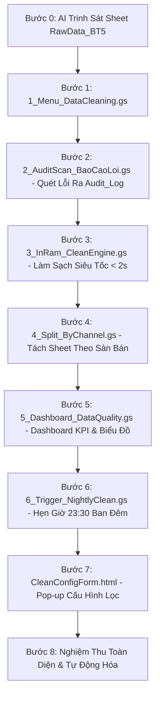

# KẾ HOẠCH THỰC HÀNH CHUẨN BÀI 5: HỆ THỐNG KIỂM TOÁN & LÀM SẠCH DỮ LIỆU LỚN IN-MEMORY
## KIẾN TRÚC VI BƯỚC ĐỘC LẬP (1 BƯỚC = 1 FILE DUY NHẤT)

> **Mô hình 1 Vi Bước = 1 File Độc Lập:** Dựa trên file dữ liệu `bai_tap_5_raw_data_1000_rows.csv` (sheet `RawData_BT5`), học viên sẽ xây dựng một ứng dụng Kiểm Toán & Làm Sạch Dữ Liệu Lớn E-Commerce hoàn chỉnh. Mỗi bước chỉ tạo đúng 1 file trong Google Apps Script Editor và bấm chạy nghiệm thu ngay lập tức!

---

## 📂 SƠ ĐỒ TOÀN BỘ CÁC FILE ĐỘC LẬP TRONG DỰ ÁN

```
📁 Big Data Quality & Cleaning System
├── 📜 1_Menu_DataCleaning.gs    (Bước 1: Menu tiện ích trên thanh công cụ & Gọi popup)
├── 📜 2_AuditScan_BaoCaoLoi.gs   (Bước 2: Quét kiểm toán dữ liệu thô ra sheet Audit_Log)
├── 📜 3_InRam_CleanEngine.gs    (Bước 3: Động cơ làm sạch mảng trên RAM < 2s, xuất DataCleaned_BT5)
├── 📜 4_Split_ByChannel.gs      (Bước 4: Tự động tách dữ liệu thành các sheet theo sàn bán hàng)
├── 📜 5_Dashboard_DataQuality.gs(Bước 5: Khởi tạo Dashboard KPI chất lượng & 2 Biểu đồ)
├── 📜 6_Trigger_NightlyClean.gs (Bước 6: Cài đặt Time-driven Trigger chạy ngầm 23:30 mỗi đêm)
└── 🌐 CleanConfigForm.html      (Bước 7: Giao diện Pop-up cấu hình quy tắc lọc Aesthetic Blue)
```

---

## 🔄 LỘ TRÌNH 8 VI BƯỚC THỰC HÀNH CHI TIẾT



---

### 🧠 BƯỚC 0: YÊU CẦU AI TỰ ĐỌC & NẮM RÕ SHEET `RawData_BT5`

* **Mục tiêu:** Cho AI đọc link Google Sheets để hiểu cấu trúc 6 cột dữ liệu thô và nhận diện các dạng dữ liệu bẩn trước khi sinh mã.
* **Câu Prompt Bước 0:**

```text
Link Google Sheets: [Dán đường link bảng tính của bạn vào đây]

Tôi đang có một file bảng tính quản lý dữ liệu log đơn hàng đa sàn tại trang tính "RawData_BT5".
Nhiệm vụ của bạn ở bước này:
1. Hãy truy cập vào link bảng tính và kiểm kê kỹ trang tính "RawData_BT5".
2. Xác định rõ: Tên 6 cột dữ liệu (từ Cột A đến Cột F), dòng tiêu đề (Dòng 3) và dòng bắt đầu có dữ liệu thực tế (Dòng 4 trở đi).
3. Chỉ ra sơ bộ các dạng dữ liệu không chuẩn hiện có (mã rỗng, mã trùng, số điện thoại có dấu chấm hoặc mất số 0, họ tên thừa khoảng trắng, doanh thu âm).
4. Tóm tắt ngắn gọn cấu trúc để xác nhận bạn đã hiểu đúng trước khi làm việc.

⚠️ Lưu ý: Chưa viết bất kỳ dòng code nào ở bước này.
```

---

### 📌 BƯỚC 1: TẠO FILE `1_Menu_DataCleaning.gs` (MENU ĐIỀU KHIỂN TRUNG TÂM)

* **Thao tác:** Mở Apps Script ➔ Bấm dấu `(+)` chọn Script ➔ Đặt tên file là `1_Menu_DataCleaning.gs` ➔ Dán mã AI sinh ra vào.
* **Câu Prompt Bước 1:**

```text
[TIÊU CHUẨN KỸ THUẬT]: Bạn là Chuyên gia Google Apps Script. Hãy tuân thủ nghiêm ngặt toàn bộ nguyên tắc trong tài liệu "QUY_TAC_SINH_CODE_APPS_SCRIPT_AI.md" đính kèm.

[YÊU CẦU NGHIỆP VỤ - FILE 1_Menu_DataCleaning.gs]:
Dựa vào bảng tính đã trinh sát ở Bước 0, hãy viết mã cho file độc lập "1_Menu_DataCleaning.gs" chứa hàm onOpen() để tạo Menu "🧹 Làm Sạch Dữ Liệu" trên thanh công cụ Google Sheets gồm các chức năng:

1. 📊 1. Dashboard Chất Lượng Dữ Liệu (gọi hàm khoiTaoDashboardDataQuality)
   [Đường gạch ngang phân cách]
2. 🔍 2. Quét Kiểm Toán Lỗi (Ra Sheet Audit_Log) (gọi hàm chayKiemToanDuLieuAuditLog)
3. ⚡ 3. Chạy Làm Sạch Dữ Liệu (< 2s) (gọi hàm chayLamSachDuLieuInRam)
4. 📂 4. Tách Dữ Liệu Theo Kênh Bán Hàng (gọi hàm tachDuLieuTheoKenhBan)
   [Đường gạch ngang phân cách]
5. ⚙️ 5. Cấu Hình Quy Tắc Lọc (Pop-up) (gọi hàm moFormCauHinhLoc mở file 'CleanConfigForm' kích thước 680x560px)
   [Đường gạch ngang phân cách]
6. ⏰ 6. Bật Tự Động Hóa (23:30 Hàng Đêm) (gọi hàm caiDatTriggerLamSachHangDem)
7. 🛑 Tắt Tự Động Hóa Định Kỳ (gọi hàm huyTriggerLamSach)
   [Đường gạch ngang phân cách]
8. ❓ Hướng Dẫn Sử Dụng (hiện hộp thoại tóm tắt quy trình 5 bước)

[YÊU CẦU ĐẦU RA]:
- Xuất khối mã hoàn chỉnh cho file "1_Menu_DataCleaning.gs", có bọc kiểm tra an toàn nếu các hàm ở bước sau chưa được tạo.
```

---

### 🔍 BƯỚC 2: TẠO FILE `2_AuditScan_BaoCaoLoi.gs` (BƯỚC ĐỆM KIỂM TOÁN LỖI AN TOÀN)

* **Thao tác:** Bấm dấu `(+)` chọn Script ➔ Đặt tên file là `2_AuditScan_BaoCaoLoi.gs` ➔ Dán mã quét kiểm toán an toàn xuất ra sheet `Audit_Log`.
* **Câu Prompt Bước 2:**

```text
[TIÊU CHUẨN KỸ THUẬT]: Bạn là Chuyên gia Google Apps Script. Hãy tuân thủ nghiêm ngặt toàn bộ nguyên tắc trong tài liệu "QUY_TAC_SINH_CODE_APPS_SCRIPT_AI.md" đính kèm.

[YÊU CẦU NGHIỆP VỤ - FILE 2_AuditScan_BaoCaoLoi.gs]:
Hãy viết toàn bộ mã nguồn cho file độc lập "2_AuditScan_BaoCaoLoi.gs" chứa hàm chayKiemToanDuLieuAuditLog() để quét kiểm tra dữ liệu thô và xuất báo cáo an toàn:

1. Đọc toàn bộ dữ liệu từ sheet "RawData_BT5" (bắt đầu từ dòng 4) bằng getValues() 1 lần duy nhất vào bộ nhớ RAM.
2. Kiểm tra chi tiết từng dòng và phát hiện các dạng lỗi:
   - Mã GD rỗng hoặc bị trùng lặp (dùng Set để phát hiện mã xuất hiện từ lần thứ 2 trở đi).
   - Doanh thu âm hoặc bằng 0.
   - Số điện thoại sai định dạng: chứa dấu chấm, khoảng trắng, gạch ngang hoặc chỉ có 9 số (bị mất số 0).
   - Họ tên khách hàng: chứa khoảng trắng thừa kép hoặc viết hoa/thường lộn xộn.
3. Tạo mới hoặc làm sạch trang tính tên "Audit_Log" nằm ở vị trí số 2 (sau RawData_BT5):
   - Hàng 1: Banner "📋 BÁO CÁO KIỂM TOÁN CHẤT LƯỢNG DỮ LIỆU (DATA AUDIT LOG)" nền xanh Navy #1B365D, chữ trắng in đậm cỡ 14.
   - Hàng 2: Dòng tóm tắt thống kê: Tổng dòng quét, số dòng hợp lệ, số mã rỗng, trùng mã, lỗi doanh thu, SĐT cần sửa, Tên cần sửa.
   - Hàng 4: Tiêu đề 8 cột: Dòng Lỗi, Mã Giao Dịch, Tên Khách Hàng, Số Điện Thoại, Kênh Bán, Doanh Thu, Mức Độ (LỖI NGHIÊM TRỌNG / CẢNH BÁO), Chi Tiết Lỗi Phát Hiện.
4. Ghi toàn bộ danh sách các dòng có lỗi xuống sheet "Audit_Log" 1 lần duy nhất bằng setValues() và format tiền tệ cho cột Doanh Thu.
5. Hiển thị hộp thoại Alert thông báo số lượng bản ghi phát hiện lỗi và chuyển tab sang "Audit_Log".

[YÊU CẦU ĐẦU RA]:
- Xuất khối mã hoàn chỉnh cho file "2_AuditScan_BaoCaoLoi.gs", tuyệt đối không chỉnh sửa đè lên dữ liệu thô gốc.
```

---

### ⚡ BƯỚC 3: TẠO FILE `3_InRam_CleanEngine.gs` (ĐỘNG CƠ LÀM SẠCH TRÊN RAM SIÊU TỐC < 2s)

* **Thao tác:** Bấm dấu `(+)` chọn Script ➔ Đặt tên file là `3_InRam_CleanEngine.gs` ➔ Dán mã động cơ làm sạch trên RAM xuất tab `DataCleaned_BT5`.
* **Câu Prompt Bước 3:**

```text
[TIÊU CHUẨN KỸ THUẬT]: Bạn là Chuyên gia Google Apps Script. Hãy tuân thủ nghiêm ngặt toàn bộ nguyên tắc trong tài liệu "QUY_TAC_SINH_CODE_APPS_SCRIPT_AI.md" đính kèm (In-Memory Batching, getValues/setValues đúng 1 lần).

[YÊU CẦU NGHIỆP VỤ - FILE 3_InRam_CleanEngine.gs]:
Hãy viết mã cho file độc lập "3_InRam_CleanEngine.gs" chứa hàm chayLamSachDuLieuInRam() để làm sạch hơn 1.000 dòng dữ liệu trong dưới 2 giây:

1. Đọc dữ liệu từ "RawData_BT5" vào mảng 2 chiều trong RAM bằng getValues().
2. Quy tắc lọc và chuẩn hóa dữ liệu trên RAM:
   - Loại bỏ các dòng có Mã Giao Dịch rỗng.
   - Sử dụng Set() tra cứu O(1) để loại bỏ triệt để các mã giao dịch trùng lặp (chỉ giữ lại dòng đầu tiên).
   - Loại bỏ các dòng có Doanh Thu <= 0.
   - Chuẩn hóa Họ Tên: Tạo hàm phụ chuanHoaTenTiengViet(str) xóa khoảng trắng thừa đầu/cuối/giữa và viết hoa chữ cái đầu từng từ (Proper Case: "  nguyễn  văn an " -> "Nguyễn Văn An").
   - Chuẩn hóa Số Điện Thoại: Xóa toàn bộ ký tự (. - space) và tự động thêm số "0" vào đầu nếu SĐT có 9 chữ số.
   - Chuẩn hóa Ngày Tạo: Giữ định dạng ngày tháng chuẩn dd/MM/yyyy.
   - Cột Trạng Thái: Gắn giá trị "Hợp Lệ".
3. Tạo mới hoặc làm sạch trang tính tên "DataCleaned_BT5":
   - Hàng 1: Banner "✨ BẢNG DỮ LIỆU ĐÃ ĐƯỢC LÀM SẠCH & CHUẨN HÓA (CLEAN DATA)" nền xanh Navy #1B365D, chữ trắng in đậm.
   - Hàng 3: Header 7 cột (Mã Giao Dịch, Tên Khách Hàng, Số Điện Thoại, Kênh Bán, Doanh Thu, Ngày Tạo, Trạng Thái) nền xanh dương #005A9C, chữ trắng in đậm.
   - Ghi toàn bộ dữ liệu sạch từ dòng 4 trở đi đúng 1 lần duy nhất bằng setValues().
   - Định dạng cột Doanh Thu '#,##0', căn giữa cột Mã GD, SĐT, Ngày Tạo và autoResizeColumns.
4. Đo thời gian thực thi (execution time) bằng startTime = new Date().getTime() và hiển thị hộp thoại Alert thống kê chi tiết: Thời gian hoàn tất (giây), Dòng ban đầu, Dòng sạch hợp lệ, Số dòng đã loại theo từng nguyên nhân.

[YÊU CẦU ĐẦU RA]:
- Xuất khối mã hoàn chỉnh cho file "3_InRam_CleanEngine.gs".
```

---

### 📂 BƯỚC 4: TẠO FILE `4_Split_ByChannel.gs` (TỰ ĐỘNG PHÂN BỔ THEO KÊNH BÁN HÀNG)

* **Thao tác:** Bấm dấu `(+)` chọn Script ➔ Đặt tên file là `4_Split_ByChannel.gs` ➔ Dán mã tự động chia tách sheet theo từng sàn thương mại điện tử.
* **Câu Prompt Bước 4:**

```text
[TIÊU CHUẨN KỸ THUẬT]: Bạn là Chuyên gia Google Apps Script. Hãy tuân thủ nghiêm ngặt toàn bộ nguyên tắc trong tài liệu "QUY_TAC_SINH_CODE_APPS_SCRIPT_AI.md" đính kèm.

[YÊU CẦU NGHIỆP VỤ - FILE 4_Split_ByChannel.gs]:
Hãy viết mã cho file độc lập "4_Split_ByChannel.gs" chứa hàm tachDuLieuTheoKenhBan() để tự động phân bổ dữ liệu sạch cho từng bộ phận:

1. Nguồn dữ liệu: Đọc từ trang tính "DataCleaned_BT5" đã làm sạch ở Bước 3 (kiểm tra nếu chưa có sheet thì nhắc người dùng chạy Bước 3 trước).
2. Gom nhóm theo Kênh Bán (Cột D): Tự động gom nhóm toàn bộ các dòng theo từng kênh (Shopee, Lazada, TikTok Shop, Website...).
3. Tự động tạo hoặc làm mới từng sheet mang tên theo kênh:
   - Tên sheet: "Sàn_Shopee", "Sàn_Lazada", "Sàn_TikTok Shop", "Sàn_Website".
   - Banner từng sàn với màu thương hiệu đặc trưng: Shopee màu cam #EE4D2D, Lazada màu xanh đậm #0f146d, TikTok Shop màu đen #000000, Website màu xanh dương #2563eb.
   - Ghi dữ liệu của từng sàn tương ứng, định dạng số tiền '#,##0' và căn lề đẹp mắt.
4. Hiển thị hộp thoại Alert tổng kết số lượng đơn hàng đã được phân bổ về từng sàn.

[YÊU CẦU ĐẦU RA]:
- Xuất khối mã hoàn chỉnh cho file "4_Split_ByChannel.gs".
```

---

### 📊 BƯỚC 5: TẠO FILE `5_Dashboard_DataQuality.gs` (DASHBOARD THỐNG KÊ & KPI CHẤT LƯỢNG)

* **Thao tác:** Bấm dấu `(+)` chọn Script ➔ Đặt tên file là `5_Dashboard_DataQuality.gs` ➔ Dán mã tạo 4 thẻ KPI và 2 biểu đồ phân tích.
* **Câu Prompt Bước 5:**

```text
[TIÊU CHUẨN KỸ THUẬT]: Bạn là Chuyên gia Google Apps Script. Hãy tuân thủ nghiêm ngặt toàn bộ nguyên tắc trong tài liệu "QUY_TAC_SINH_CODE_APPS_SCRIPT_AI.md" đính kèm (Biểu đồ asPieChart, asColumnChart, setNumHeaders(1), Locale VN dấu ;).

[YÊU CẦU NGHIỆP VỤ - FILE 5_Dashboard_DataQuality.gs]:
Hãy viết toàn bộ mã nguồn cho file độc lập "5_Dashboard_DataQuality.gs" chứa hàm khoiTaoDashboardDataQuality() để xây dựng Dashboard kiểm soát chất lượng dữ liệu:

1. Khởi tạo trang "📊 Dashboard Dữ Liệu" ở vị trí đầu tiên (Sheet 1):
   - Hàng 1: Banner "📊 BÁO CÁO KIỂM SOÁT CHẤT LƯỢNG & DOANH THU ĐƠN HÀNG" nền Navy #1B365D, chữ trắng in đậm cỡ 18.
   - Hàng 3: Dòng ngày giờ cập nhật tự động.
2. 4 thẻ KPI chất lượng (Hàng 5 đến Hàng 7):
   - 📥 TỔNG DÒNG THÔ (Cột A-B): Số dòng tiếp nhận từ RawData_BT5.
   - ✅ DỮ LIỆU SẠCH (Cột C-D): Số dòng hợp lệ trong DataCleaned_BT5 (màu xanh lá #059669).
   - 🗑️ BẢN GHI RÁC ĐÃ LỌC (Cột E-F): Số dòng lỗi đã loại bỏ (màu đỏ #dc2626).
   - 🎯 ĐỘ CHÍNH XÁC (Cột G-H): Tỷ lệ % dữ liệu sạch trên tổng số dòng thô (màu tím #7c3aed).
3. Trang tính phụ "Calc_Data_Clean" (giữ hiển thị bình thường, không ẩn tab):
   - Bảng 1 (A1:B5): Tổng doanh thu từng kênh bán (Shopee, Lazada, TikTok Shop, Website) dùng công thức SUMIFS chuẩn dấu chấm phẩy ';'.
   - Bảng 2 (D1:E5): Cơ cấu các loại lỗi từ sheet Audit_Log dùng COUNTIF chuẩn dấu ';'.
4. Tự động vẽ 2 biểu đồ đặt tại Hàng 9:
   - Biểu đồ tròn (PIE): Cơ cấu doanh thu theo kênh bán (đặt tại A9, kích thước 490x360px, 3D, hiển thị chú thích).
   - Biểu đồ cột (COLUMN): Phân loại các dạng lỗi trong dữ liệu thô (đặt tại E9, kích thước 560x360px, cột màu đỏ cảnh báo).

[YÊU CẦU ĐẦU RA]:
- Xuất khối mã hoàn chỉnh cho file "5_Dashboard_DataQuality.gs".
```

---

### ⏰ BƯỚC 6: TẠO FILE `6_Trigger_NightlyClean.gs` (TỰ ĐỘNG HÓA ĐỊNH KỲ 23:30 HÀNG ĐÊM)

* **Thao tác:** Bấm dấu `(+)` chọn Script ➔ Đặt tên file là `6_Trigger_NightlyClean.gs` ➔ Dán mã cài đặt trigger tự động hóa ban đêm.
* **Câu Prompt Bước 6:**

```text
[TIÊU CHUẨN KỸ THUẬT]: Bạn là Chuyên gia Google Apps Script. Hãy tuân thủ nghiêm ngặt toàn bộ nguyên tắc trong tài liệu "QUY_TAC_SINH_CODE_APPS_SCRIPT_AI.md" đính kèm.

[YÊU CẦU NGHIỆP VỤ - FILE 6_Trigger_NightlyClean.gs]:
Hãy viết mã cho file độc lập "6_Trigger_NightlyClean.gs" để cài đặt cơ chế tự động hóa định kỳ không cần mở máy tính:

1. Hàm caiDatTriggerLamSachHangDem():
   - Tự động quét và xóa trigger cũ trùng lặp nếu đã cài trước đó để tránh kích hoạt nhiều lần.
   - Tạo Time-driven Trigger mới chạy hàm chayTuDongLamSachVaBaoCao() lặp lại mỗi ngày (everyDays(1)) vào khung giờ 23:00 - 24:00 đêm (atHour(23).nearMinute(30)).
   - Hiển thị hộp thoại Alert thông báo đã kích hoạt tự động hóa thành công.
2. Hàm huyTriggerLamSach():
   - Quét tìm tất cả các trigger đang liên kết với hàm chayTuDongLamSachVaBaoCao() và xóa bỏ hoàn toàn.
3. Hàm điều phối chayTuDongLamSachVaBaoCao():
   - Tự động gọi lần lượt: chayLamSachDuLieuInRam(), tachDuLieuTheoKenhBan() và khoiTaoDashboardDataQuality().

[YÊU CẦU ĐẦU RA]:
- Xuất khối mã hoàn chỉnh cho file "6_Trigger_NightlyClean.gs".
```

---

### 🌐 BƯỚC 7: TẠO FILE `CleanConfigForm.html` (GIAO DIỆN POP-UP CẤU HÌNH QUY TẮC LỌC)

* **Thao tác:** Bấm dấu `(+)` chọn HTML ➔ Đặt tên file là `CleanConfigForm.html` ➔ Dán mã giao diện pop-up Aesthetic Blue.
* **Câu Prompt Bước 7:**

```text
Hãy thiết kế mã nguồn cho tệp giao diện pop-up "CleanConfigForm.html" phục vụ cấu hình bộ lọc dữ liệu:

1. Giao diện & Thư viện:
   - Sử dụng Bootstrap 5 và FontAwesome 6 qua CDN.
   - Phong cách thiết kế Aesthetic Blue cao cấp, font chữ hệ thống hiện đại, bo góc tròn 12px, nền card trắng sáng bóng bẩy.
2. Nội dung biểu mẫu cấu hình:
   - Tiêu đề: "⚙️ Cấu Hình Quy Tắc Làm Sạch Dữ Liệu" (icon sliders màu xanh).
   - 5 Checkbox tùy chọn có mô tả phụ nhỏ gọn bên dưới:
     1. Khử trùng lặp mã giao dịch (Deduplication - Set() O(1)) [Mặc định: Bật]
     2. Tự động chuẩn hóa số điện thoại (Xóa ký tự lạ, thêm số 0 đầu) [Mặc định: Bật]
     3. Chuẩn hóa viết hoa họ tên (Proper Case) [Mặc định: Bật]
     4. Loại bỏ đơn có doanh thu <= 0 [Mặc định: Bật]
     5. Tự động chia tách sheet theo từng kênh bán [Mặc định: Bật]
   - Nút bấm chính "🚀 Bắt Đầu Xử Lý Ngay (< 2s)" nền xanh Navy #1B365D.
3. Tương tác JavaScript:
   - Khi bấm nút, nút chuyển sang trạng thái loading với icon xoay và gọi google.script.run.chayLamSachDuLieuInRam().
   - Khi xử lý thành công, tự động đóng cửa sổ modal bằng google.script.host.close().
```

---

### 🎯 BƯỚC 8: NGHIỆM THU TOÀN DIỆN & TỰ ĐỘNG HÓA HOÀN TẤT
1. Bấm menu `🧹 Làm Sạch Dữ Liệu` ➔ `2. Quét Kiểm Toán Lỗi` ➔ Kiểm tra sheet `Audit_Log`.
2. Bấm menu `3. Chạy Làm Sạch Dữ Liệu` ➔ Kiểm tra sheet `DataCleaned_BT5` xuất hiện trong dưới 2 giây.
3. Bấm menu `4. Tách Dữ Liệu Theo Kênh Bán Hàng` ➔ Kiểm tra 4 tab của các sàn.
4. Bấm menu `1. Dashboard Chất Lượng Dữ Liệu` ➔ Kiểm tra 4 thẻ KPI và 2 biểu đồ tròn/cột.
5. Bật hẹn giờ 23:30 để hệ thống tự vận hành hàng đêm.
