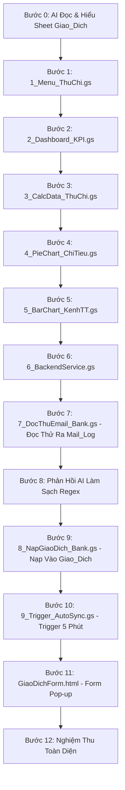

# KẾ HOẠCH THỰC HÀNH CHUẨN BÀI 6: HỆ THỐNG QUẢN LÝ SỔ QUỸ THU CHI, TỰ ĐỘNG ĐỒNG BỘ GMAIL & DASHBOARD DÒNG TIỀN
## KIẾN TRÚC VI BƯỚC ĐỘC LẬP (1 BƯỚC = 1 FILE / 1 THAO TÁC DUY NHẤT)

> **Triết lý thực hành:** Dựa trên file dữ liệu `bai6.xlsx` (trang `Giao_Dich`), học viên sẽ xây dựng một ứng dụng Quản lý Sổ Quỹ Thu Chi, Tự động quét Gmail ngân hàng (qua bước đọc thử `Mail_Log`, tinh chỉnh phản hồi AI và nạp chính thức) & Dashboard Dòng Tiền hoàn chỉnh.

---

## 📂 SƠ ĐỒ CÁC FILE ĐỘC LẬP TRONG DỰ ÁN

```
📁 Thu Chi & Cashflow Management System
├── 📜 1_Menu_ThuChi.gs      (Bước 1: Menu tiện ích trên thanh công cụ & Tích hợp Đồng bộ Gmail)
├── 📜 2_Dashboard_KPI.gs   (Bước 2: Khởi tạo Dashboard & 4 thẻ KPI Thu/Chi/Số Dư)
├── 📜 3_CalcData_ThuChi.gs (Bước 3: Bảng phụ Calc_Data tính toán gom nhóm)
├── 📜 4_PieChart_ChiTieu.gs(Bước 4: Vẽ biểu đồ tròn cơ cấu chi tiêu theo nhóm)
├── 📜 5_BarChart_KenhTT.gs (Bước 5: Vẽ biểu đồ cột chi tiêu theo kênh thanh toán)
├── 📜 6_BackendService.gs  (Bước 6: Backend xử lý thêm giao dịch thủ công, tính VAT & ghi log)
├── 📜 7_DocThuEmail_Bank.gs(Bước 7: Đọc thử email BIDV & trích xuất ra sheet "Mail_Log")
├── 💬 Prompt Phản Hồi AI   (Bước 8: Phản hồi kết quả thực tế để AI sửa & làm sạch Regex 100%)
├── 📜 8_NapGiaoDich_Bank.gs(Bước 9: Nạp chuẩn 12 cột vào sheet "Giao_Dich" & cập nhật Dashboard)
├── 📜 9_Trigger_AutoSync.gs(Bước 10: Cài đặt Time-driven Trigger chạy ngầm mỗi 5 phút)
└── 🌐 GiaoDichForm.html    (Bước 11: Form Pop-up Nhập giao dịch thủ công Aesthetic Blue)
```

---

## 🔄 LỘ TRÌNH 12 VI BƯỚC THỰC HÀNH CHI TIẾT



---

### 🧠 BƯỚC 0: YÊU CẦU AI TỰ ĐỌC & NẮM RÕ SHEET `Giao_Dich`

* **Câu Prompt Bước 0:**

```text
Link Google Sheets: [Dán đường link bảng tính của bạn vào đây]

Tôi đang có một file bảng tính quản lý giao dịch thu chi "Giao_Dich" ở đường link trên.
Nhiệm vụ của bạn ở bước này:
1. Hãy truy cập vào link bảng tính và đọc kỹ trang tính "Giao_Dich".
2. Nắm rõ: tên các cột dữ liệu (từ Cột A đến Cột L), dòng tiêu đề (Dòng 2), dòng bắt đầu có dữ liệu thực tế (Dòng 3) và các loại giao dịch (Thu / Chi).
3. Tóm tắt ngắn gọn lại những gì bạn đã đọc được để tôi biết bạn đã hiểu đúng cấu trúc dữ liệu.

⚠️ Lưu ý: Chưa viết bất kỳ dòng code nào ở bước này.
```

---

### 🚀 BƯỚC 1: TẠO MENU QUẢN LÝ THU CHI TRÊN GOOGLE SHEETS

* **Thao tác:** Mở Apps Script ➔ Bấm dấu `+` ➔ chọn **Script** ➔ Đặt tên file là `1_Menu_ThuChi.gs`.
* **Câu Prompt Bước 1:**

```text
[TIÊU CHUẨN KỸ THUẬT]: Bạn là Chuyên gia Google Apps Script. Hãy tuân thủ nghiêm ngặt toàn bộ nguyên tắc trong tài liệu "QUY_TAC_SINH_CODE_APPS_SCRIPT_AI.md" đính kèm.

[YÊU CẦU NGHIỆP VỤ - TẠO MENU QUẢN LÝ THU CHI]:
Dựa vào bảng tính thu chi đã phân tích ở trên, hãy viết hàm onOpen() để tự động tạo một Menu tên là "Quản Lý Thu Chi" trên thanh công cụ Google Sheets với các mục sau:

1. Dashboard Sổ Quỹ
2. Đọc Thử Email Ra Bảng Mail_Log (kiểm tra trước khi nạp)
3. Nạp Giao Dịch Vào Sổ Quỹ Giao_Dich
4. Bật Tự Động Quét Email (Mỗi 5 Phút)
5. Tắt Tự Động Quét Email
6. Nhập Giao Dịch Thu Chi Thủ Công
7. Hướng Dẫn Sử Dụng

[YÊU CẦU ĐẦU RA]:
- Xuất khối mã Apps Script hoàn chỉnh, có bọc khối kiểm tra an toàn (nếu chức năng nào đang trong quá trình thiết lập thì hiện thông báo nhắc nhở, không để báo lỗi đỏ).
```

---

### 📊 BƯỚC 2: TẠO TRANG DASHBOARD & 4 THẺ TỔNG QUAN THU CHI

* **Thao tác:** Mở Apps Script ➔ Bấm dấu `+` ➔ chọn **Script** ➔ Đặt tên file là `2_Dashboard_KPI.gs`.
* **Câu Prompt Bước 2:**

```text
[TIÊU CHUẨN KỸ THUẬT]: Bạn là Chuyên gia Google Apps Script. Hãy tuân thủ nghiêm ngặt toàn bộ nguyên tắc trong tài liệu "QUY_TAC_SINH_CODE_APPS_SCRIPT_AI.md" đính kèm.

[YÊU CẦU NGHIỆP VỤ - THIẾT LẬP DASHBOARD SỔ QUỸ]:
Hãy viết mã Google Apps Script để xây dựng giao diện Dashboard sổ quỹ dòng tiền:

1. Khởi tạo trang tính tên là "Dashboard Sổ Quỹ" nằm ở vị trí đầu tiên (nếu đã có trang này thì làm sạch nội dung cũ để tạo mới).
2. Thiết kế Banner tiêu đề:
   - Dòng 1: Tiêu đề nổi bật "SỔ QUỸ THU CHI & QUẢN TRỊ DÒNG TIỀN 2026" (nền xanh navy đậm #0f4c81, chữ trắng in đậm).
   - Dòng 3: Hiển thị ngày giờ cập nhật dữ liệu tự động.
3. Thiết kế 4 ô thông tin tổng quan (từ Hàng 5 đến Hàng 7):
   - Tổng Thu: Tính tổng cột "Tổng Sau Thuế" của các khoản "Thu" từ bảng Giao_Dich (định dạng tiền tệ VNĐ).
   - Tổng Chi: Tính tổng cột "Tổng Sau Thuế" của các khoản "Chi" từ bảng Giao_Dich (định dạng tiền tệ VNĐ).
   - Số Dư Quỹ Thực Tế: Lấy Tổng Thu trừ Tổng Chi (định dạng tiền tệ VNĐ).
   - Tỷ Lệ Chi / Thu: Tính tỷ lệ % giữa Tổng Chi trên Tổng Thu (định dạng 0.0%).

[YÊU CẦU ĐẦU RA]:
- Xuất khối mã Apps Script hoàn chỉnh, có hàm điều phối tự động kết nối các biểu đồ khi các bước sau hoàn thành.
```

---

### 📈 BƯỚC 3: TẠO BẢNG PHỤ GOM NHÓM SỐ LIỆU BIỂU ĐỒ

* **Thao tác:** Mở Apps Script ➔ Bấm dấu `+` ➔ chọn **Script** ➔ Đặt tên file là `3_CalcData_ThuChi.gs`.
* **Câu Prompt Bước 3:**

```text
[TIÊU CHUẨN KỸ THUẬT]: Bạn là Chuyên gia Google Apps Script. Hãy tuân thủ nghiêm ngặt toàn bộ nguyên tắc trong tài liệu "QUY_TAC_SINH_CODE_APPS_SCRIPT_AI.md" đính kèm.

[YÊU CẦU NGHIỆP VỤ - TẠO BẢNG TÍNH PHỤ CHO BIỂU ĐỒ]:
Hãy viết mã Apps Script tạo trang tính phụ tên là "Calc_Data" để tổng hợp số liệu nguồn vẽ biểu đồ:

1. Bảng tổng hợp theo Nhóm chi tiêu (bắt đầu từ cột A, dòng 1):
   - Tiêu đề: "Nhóm Chi Tiêu" và "Tổng Chi Sau Thuế".
   - Liệt kê 8 nhóm: Ăn uống, Đi lại, Nhà ở, Mua sắm, Y tế, Học tập, Giải trí, Khác.
   - Dùng công thức tự động tính tổng tiền chi theo từng nhóm từ bảng Giao_Dich.

2. Bảng tổng hợp theo Kênh thanh toán (bắt đầu từ cột D, dòng 1):
   - Tiêu đề: "Kênh Thanh Toán" và "Tổng Chi".
   - Liệt kê 4 kênh: Tiền mặt, Chuyển khoản, Ví điện tử, Thẻ ngân hàng.
   - Dùng công thức tự động tính tổng tiền chi theo từng kênh.

[YÊU CẦU ĐẦU RA]:
- Xuất khối mã Apps Script hoàn chỉnh, giữ bảng tính hiển thị sạch sẽ để biểu đồ đọc dữ liệu ổn định.
```

---

### 🥧 BƯỚC 4: TỰ ĐỘNG VẼ BIỂU ĐỒ TRÒN CƠ CẤU CHI TIÊU

* **Thao tác:** Mở Apps Script ➔ Bấm dấu `+` ➔ chọn **Script** ➔ Đặt tên file là `4_PieChart_ChiTieu.gs`.
* **Câu Prompt Bước 4:**

```text
[TIÊU CHUẨN KỸ THUẬT]: Bạn là Chuyên gia Google Apps Script. Hãy tuân thủ nghiêm ngặt toàn bộ nguyên tắc trong tài liệu "QUY_TAC_SINH_CODE_APPS_SCRIPT_AI.md" đính kèm.

[YÊU CẦU NGHIỆP VỤ - VẼ BIỂU ĐỒ TRÒN CƠ CẤU CHI TIÊU]:
Hãy viết mã Apps Script tự động vẽ Biểu đồ tròn trên trang "Dashboard Sổ Quỹ":

1. Nguồn dữ liệu: Lấy từ bảng Nhóm chi tiêu trên trang Calc_Data.
2. Vị trí đặt biểu đồ: Đặt tại Hàng 9 Cột A trên trang Dashboard (kích thước vừa vặn khoảng 490px x 360px).
3. Định dạng biểu đồ:
   - Tiêu đề biểu đồ: "CƠ CẤU CHI TIÊU THEO TỪNG NHÓM" (màu xanh navy sang trọng).
   - Hiển thị rõ tỷ lệ phần trăm (%) trên từng lát cắt và có chú thích danh mục rõ ràng bên phải.

[YÊU CẦU ĐẦU RA]:
- Xuất khối mã Apps Script hoàn chỉnh, tự động xóa biểu đồ cũ nếu đã tồn tại trước khi vẽ mới.
```

---

### 📊 BƯỚC 5: TỰ ĐỘNG VẼ BIỂU ĐỒ CỘT KÊNH THANH TOÁN

* **Thao tác:** Mở Apps Script ➔ Bấm dấu `+` ➔ chọn **Script** ➔ Đặt tên file là `5_BarChart_KenhTT.gs`.
* **Câu Prompt Bước 5:**

```text
[TIÊU CHUẨN KỸ THUẬT]: Bạn là Chuyên gia Google Apps Script. Hãy tuân thủ nghiêm ngặt toàn bộ nguyên tắc trong tài liệu "QUY_TAC_SINH_CODE_APPS_SCRIPT_AI.md" đính kèm.

[YÊU CẦU NGHIỆP VỤ - VẼ BIỂU ĐỒ CỘT KÊNH THANH TOÁN]:
Hãy viết mã Apps Script tự động vẽ Biểu đồ cột trên trang "Dashboard Sổ Quỹ":

1. Nguồn dữ liệu: Lấy từ bảng Kênh thanh toán trên trang Calc_Data.
2. Vị trí đặt biểu đồ: Đặt tại Hàng 9 Cột E trên trang Dashboard (nằm song song bên phải Biểu đồ tròn, kích thước khoảng 560px x 360px).
3. Định dạng biểu đồ:
   - Tiêu đề: "CHI TIÊU THEO KÊNH THANH TOÁN" (cột màu xanh dương hiện đại).
   - Trục ngang thể hiện các kênh thanh toán, trục đứng thể hiện số tiền chi.

[YÊU CẦU ĐẦU RA]:
- Xuất khối mã Apps Script hoàn chỉnh, đảm bảo 2 biểu đồ hiển thị song song cân đối bên dưới 4 thẻ tổng quan.
```

---

### ⚙️ BƯỚC 6: VIẾT CHỨC NĂNG LƯU GIAO DỊCH MỚI VÀO SỔ QUỸ

* **Thao tác:** Mở Apps Script ➔ Bấm dấu `+` ➔ chọn **Script** ➔ Đặt tên file là `6_BackendService.gs`.
* **Câu Prompt Bước 6:**

```text
[TIÊU CHUẨN KỸ THUẬT]: Bạn là Chuyên gia Google Apps Script. Hãy tuân thủ nghiêm ngặt toàn bộ nguyên tắc trong tài liệu "QUY_TAC_SINH_CODE_APPS_SCRIPT_AI.md" đính kèm.

[YÊU CẦU NGHIỆP VỤ - LƯU GIAO DỊCH MỚI]:
Hãy viết mã Apps Script xử lý việc ghi nhận một khoản thu hoặc chi mới vào sổ quỹ:

1. Tiếp nhận các thông tin giao dịch: Ngày, Tháng/Năm, Loại (Thu/Chi), Nhóm chi tiêu, Mô tả, Người liên quan, Kênh thanh toán, Số tiền, Thuế VAT, Trạng thái và Ghi chú.
2. Tự động tính: Tổng tiền sau thuế = Số tiền * (1 + VAT).
3. Thêm một dòng mới vào cuối bảng "Giao_Dich" với đúng thứ tự 12 cột (A đến L).
4. Tự động cập nhật lại số liệu trên trang Dashboard ngay sau khi lưu thành công.

[YÊU CẦU ĐẦU RA]:
- Xuất khối mã Apps Script hoàn chỉnh, có phản hồi thông báo thành công sau khi ghi dữ liệu.
```

---

### 🔍 BƯỚC 7: ĐỌC THỬ EMAIL NGÂN HÀNG RA BẢNG MAIL_LOG ĐỂ KIỂM TRA

* **Thao tác:** Mở Apps Script ➔ Bấm dấu `+` ➔ chọn **Script** ➔ Đặt tên file là `7_DocThuEmail_Bank.gs`.
* **Câu Prompt Bước 7:**

```text
[TIÊU CHUẨN KỸ THUẬT]: Bạn là Chuyên gia Google Apps Script. Hãy tuân thủ nghiêm ngặt toàn bộ nguyên tắc trong tài liệu "QUY_TAC_SINH_CODE_APPS_SCRIPT_AI.md" đính kèm.

[YÊU CẦU NGHIỆP VỤ - ĐỌC THỬ EMAIL BIÊN LAI NGÂN HÀNG]:
Hãy viết mã Apps Script quét email ngân hàng và xuất kết quả đọc được ra bảng kiểm tra:

1. Tìm kiếm các email có tiêu đề chứa "Biên lai chuyển tiền" trong Gmail.
2. Tự động bóc tách các thông tin:
   - Ngày giao dịch và Tháng/Năm
   - Mã số lệnh giao dịch
   - Loại giao dịch: Nhận tiền (Thu) hoặc Chuyển đi (Chi)
   - Người chuyển / Người nhận tiền
   - Kênh thanh toán / Ngân hàng
   - Số tiền và Nội dung chuyển tiền
3. Tạo trang tính tên là "Mail_Log" và xuất toàn bộ các dòng email đọc được vào bảng này để người dùng xem trước và kiểm chứng.

[YÊU CẦU ĐẦU RA]:
- Xuất khối mã Apps Script hoàn chỉnh, có hộp thoại thông báo số lượng email đã đọc thành công.
```

---

### 🧹 BƯỚC 8: TINH CHỈNH LÀM SẠCH SỐ LIỆU & CHỐNG NẠP TRÙNG EMAIL

* **Thao tác:** Gửi prompt phản hồi tinh chỉnh trực tiếp cho AI.
* **Câu Prompt Bước 8:**

```text
[YÊU CẦU TINH CHỈNH VÀ LÀM SẠCH DỮ LIỆU EMAIL]:
Dựa vào kết quả đọc thử email ở Bước 7, hãy tối ưu hóa lại đoạn mã với các yêu cầu thực tế sau:

1. Làm sạch ký tự rác:
   - Tên người gửi/nhận: Cắt bỏ các chữ tiếng Anh thừa ("Remitter's name...", "Tài khoản..."), chỉ giữ lại tên người hoặc công ty.
   - Số tiền: Chuẩn hóa thành số nguyên sạch (ví dụ: 15000000) để cộng trừ tính toán.
   - Nội dung: Cắt bỏ các câu cảm ơn hoặc lời chào cuối thư.
2. Tự động phân loại:
   - Nhận tiền -> Loại "Thu", trạng thái "Đã thu".
   - Chuyển đi -> Loại "Chi", trạng thái "Đã chi".
   - Tự động nhận diện Nhóm chi tiêu theo từ khóa: Ăn uống (ăn, cafe, tiec), Nhà ở (tiền điện, nước, nhà), Mua sắm (quần áo, siêu thị), Đi lại (xăng, grab, xe).
3. Cơ chế chống trùng lặp: Trước khi thêm dòng, kiểm tra xem Mã số lệnh giao dịch đã có trong bảng chưa. Nếu đã có rồi thì bỏ qua ngay để không bao giờ bị ghi đúp tiền.

Hãy xuất lại toàn bộ đoạn mã đã được tinh chỉnh hoàn hảo.
```

---

### 📥 BƯỚC 9: NẠP GIAO DỊCH EMAIL VÀO SỔ QUỸ & CẬP NHẬT DASHBOARD

* **Thao tác:** Mở Apps Script ➔ Bấm dấu `+` ➔ chọn **Script** ➔ Đặt tên file là `8_NapGiaoDich_Bank.gs`.
* **Câu Prompt Bước 9:**

```text
[TIÊU CHUẨN KỸ THUẬT]: Bạn là Chuyên gia Google Apps Script. Hãy tuân thủ nghiêm ngặt toàn bộ nguyên tắc trong tài liệu "QUY_TAC_SINH_CODE_APPS_SCRIPT_AI.md" đính kèm.

[YÊU CẦU NGHIỆP VỤ - NẠP CHÍNH THỨC VÀO SỔ QUỸ]:
Hãy viết mã Apps Script để tự động nạp giao dịch từ bảng "Mail_Log" sang bảng chính "Giao_Dich":

1. Lấy các dòng giao dịch mới trong bảng "Mail_Log" nạp sang bảng "Giao_Dich" với đầy đủ 12 cột chuẩn xác.
2. Kiểm tra cột Ghi chú trên bảng Giao_Dich để đảm bảo không nạp trùng các mã giao dịch đã có.
3. Đánh dấu trạng thái trên Mail_Log là "Đã nạp vào Giao_Dich" và đánh dấu email trên Gmail là đã đọc.
4. Tự động cập nhật lại 4 thẻ tổng quan và 2 biểu đồ trên trang Dashboard ngay sau khi nạp xong.

[YÊU CẦU ĐẦU RA]:
- Xuất khối mã Apps Script hoàn chỉnh, kèm thông báo tổng số giao dịch đã nạp thành công.
```

---

### ⏰ BƯỚC 10: BẬT TỰ ĐỘNG QUÉT EMAIL CHẠY NGẦM MỖI 5 PHÚT

* **Thao tác:** Mở Apps Script ➔ Bấm dấu `+` ➔ chọn **Script** ➔ Đặt tên file là `9_Trigger_AutoSync.gs`.
* **Câu Prompt Bước 10:**

```text
[TIÊU CHUẨN KỸ THUẬT]: Bạn là Chuyên gia Google Apps Script. Hãy tuân thủ nghiêm ngặt toàn bộ nguyên tắc trong tài liệu "QUY_TAC_SINH_CODE_APPS_SCRIPT_AI.md" đính kèm.

[YÊU CẦU NGHIỆP VỤ - CÀI ĐẶT TỰ ĐỘNG CHẠY NGẦM 24/7]:
Hãy viết mã Apps Script quản lý việc tự động chạy ngầm theo thời gian:

1. Chức năng bật tự động:
   - Tự động kích hoạt hàm nạp giao dịch chạy ngầm định kỳ mỗi 5 phút một lần (Time-driven Trigger).
   - Xóa các lịch cũ trùng lặp trước khi tạo lịch mới để tránh chạy đúp.
   - Hiển thị thông báo xác nhận đã kích hoạt tự động hóa thành công.
2. Chức năng tắt tự động:
   - Tìm và xóa bỏ toàn bộ lịch chạy ngầm khi người dùng muốn tạm dừng.

[YÊU CẦU ĐẦU RA]:
- Xuất khối mã Apps Script hoàn chỉnh, an toàn và dễ sử dụng.
```

---

### 📝 BƯỚC 11: THIẾT KẾ CỬA SỔ NHẬP GIAO DỊCH NHANH

* **Thao tác:** Mở Apps Script ➔ Bấm dấu `+` ➔ chọn **HTML** ➔ Đặt tên file là `GiaoDichForm.html`.
* **Câu Prompt Bước 11:**

```text
[YÊU CẦU THIẾT KẾ - GIAO DIỆN BIỂU MẪU NHẬP NHANH]:
Hãy thiết kế mã nguồn giao diện HTML cho cửa sổ nhập nhanh giao dịch thu chi:

1. Phong cách thiết kế:
   - Giao diện hiện đại, trực quan, bo góc trang nhã, phông chữ dễ đọc.
2. Các trường nhập liệu thông minh:
   - Ngày phát sinh (mặc định là ngày hôm nay) và Tháng/Năm.
   - Loại giao dịch: Chọn "Thu" hoặc "Chi".
   - Nhóm chi tiêu: Danh sách chọn (Ăn uống, Đi lại, Nhà ở, Mua sắm, Y tế, Học tập, Giải trí, Khác).
   - Mô tả giao dịch và Người liên quan.
   - Kênh thanh toán: Tiền mặt, Chuyển khoản, Ví điện tử, Thẻ ngân hàng.
   - Số tiền, Tùy chọn thuế VAT (0%, 8%, 10%) và Ô hiển thị Tổng sau thuế (tự động tính ngay khi nhập tiền).
   - Trạng thái và Ghi chú thêm.
3. Nút "Lưu Giao Dịch": Kết nối trực tiếp với chức năng lưu dữ liệu để ghi vào bảng Giao_Dich và cập nhật lại Dashboard.

[YÊU CẦU ĐẦU RA]:
- Xuất trọn vẹn mã HTML/CSS/JavaScript hoàn chỉnh để sử dụng trên Google Sheets.
```

---

### ✅ BƯỚC 12: NGHIỆM THU TOÀN DIỆN HỆ THỐNG

1. Tải lại trang Google Sheets (F5).
2. Menu **`💰 Quản Lý Thu Chi`** hiển thị đầy đủ các mục.
3. Bấm **`📊 Dashboard Sổ Quỹ`** ➔ Xem Banner, 4 thẻ KPI tài chính và 2 Biểu đồ.
4. Bấm **`🔍 1. Đọc Thử Email Ra Sheet Mail_Log`** ➔ Mở tab `Mail_Log` thấy thông tin bóc tách đã được làm sạch gọn gàng.
5. Bấm **`📥 2. Nạp Chính Thức Vào Sổ Quỹ Giao_Dich`** ➔ Dòng mới được thêm vào cuối sheet `Giao_Dich`, Dashboard nhảy số tức thì.
6. Bấm **`⏰ 3. Bật Tự Động Quét Gmail (Mỗi 5 Phút)`** ➔ Hệ thống tự động chạy ngầm 24/7.
7. Mở **`➕ Nhập Giao Dịch Thủ Công`** ➔ Nhập thử khoản chi tiền mặt ➔ Kiểm tra Dashboard cập nhật!
