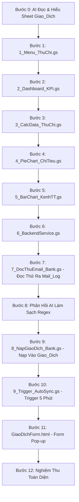

# KẾ HOẠCH THỰC HÀNH CHUẨN BÀI 6: HỆ THỐNG QUẢN LÝ SỔ QUỸ THU CHI, TỰ ĐỘNG ĐỒNG BỘ GMAIL & DASHBOARD DÒNG TIỀN
## KIẾN TRÚC VI BƯỚC ĐỘC LẬP (1 BƯỚC = 1 FILE / 1 THAO TÁC DUY NHẤT)

> **Triết lý thực hành:** Dựa trên file dữ liệu `bai6.xlsx` (trang `Giao_Dich`), học viên sẽ xây dựng một ứng dụng Quản lý Sổ Quỹ Thu Chi, Tự động quét Gmail ngân hàng (qua bước đọc thử `Mail_Log`, tinh chỉnh phản hồi AI và nạp chính thức) & Dashboard Dòng Tiền hoàn chỉnh.

---

## 📂 SƠ ĐỒ CÁC FILE ĐỘC LẬP TRONG DỰ ÁN

```
📁 Thu Chi & Cashflow Management System
├── 📜 1_Menu_ThuChi.gs      (Bước 1: Menu tiện ích trên thanh công cụ & Tích hợp Đồng bộ Gmail)
├── 📜 2_Dashboard_KPI.gs   (Bước 2: Khởi tạo Dashboard & 4 thẻ KPI Thu/Chi/Số Dư)
├── 📜 3_CalcData_ThuChi.gs (Bước 3: Bảng phụ Calc_Data tính toán gom nhóm)
├── 📜 4_PieChart_ChiTieu.gs(Bước 4: Vẽ biểu đồ tròn cơ cấu chi tiêu theo nhóm)
├── 📜 5_BarChart_KenhTT.gs (Bước 5: Vẽ biểu đồ cột chi tiêu theo kênh thanh toán)
├── 📜 6_BackendService.gs  (Bước 6: Backend xử lý thêm giao dịch thủ công, tính VAT & ghi log)
├── 📜 7_DocThuEmail_Bank.gs(Bước 7: Đọc thử email BIDV & trích xuất ra sheet "Mail_Log")
├── 💬 Prompt Phản Hồi AI   (Bước 8: Phản hồi kết quả thực tế để AI sửa & làm sạch Regex 100%)
├── 📜 8_NapGiaoDich_Bank.gs(Bước 9: Nạp chuẩn 12 cột vào sheet "Giao_Dich" & cập nhật Dashboard)
├── 📜 9_Trigger_AutoSync.gs(Bước 10: Cài đặt Time-driven Trigger chạy ngầm mỗi 5 phút)
└── 🌐 GiaoDichForm.html    (Bước 11: Form Pop-up Nhập giao dịch thủ công Aesthetic Blue)
```

---

## 🔄 LỘ TRÌNH 12 VI BƯỚC THỰC HÀNH CHI TIẾT



---

### 🧠 BƯỚC 0: YÊU CẦU AI TỰ ĐỌC & NẮM RÕ SHEET `Giao_Dich`

* **Câu Prompt Bước 0:**

```text
Link Google Sheets: [Dán đường link bảng tính của bạn vào đây]

Tôi đang có một file bảng tính quản lý giao dịch thu chi "Giao_Dich" ở đường link trên.
Nhiệm vụ của bạn ở bước này:
1. Hãy truy cập vào link bảng tính và đọc kỹ trang tính "Giao_Dich".
2. Nắm rõ: tên các cột dữ liệu (từ Cột A đến Cột L), dòng tiêu đề (Dòng 2), dòng bắt đầu có dữ liệu thực tế (Dòng 3) và các loại giao dịch (Thu / Chi).
3. Tóm tắt ngắn gọn lại những gì bạn đã đọc được để tôi biết bạn đã hiểu đúng cấu trúc dữ liệu.

⚠️ Lưu ý: Chưa viết bất kỳ dòng code nào ở bước này.
```

---

### 🚀 BƯỚC 1: TẠO FILE `1_Menu_ThuChi.gs` (MENU TIỆN ÍCH ĐẦY ĐỦ)

* **Thao tác:** Bấm dấu `+` ➔ chọn **Script** ➔ Đặt tên file là `1_Menu_ThuChi.gs`.
* **Câu Prompt Bước 1:**

```text
QUY TẮC BẮT BUỘC KHI SINH CODE APPS SCRIPT: (đính kèm file QUY_TAC_SINH_CODE_APPS_SCRIPT_AI.md)

Dựa trên bảng tính đã đọc ở Bước 0, hãy viết mã cho file độc lập "1_Menu_ThuChi.gs" để tạo thanh Menu tiện ích khi mở Google Sheets:

1. Tạo Menu tên là "💰 Quản Lý Thu Chi" gồm các mục sau:
   - "📊 Dashboard Sổ Quỹ" (gọi hàm khoiTaoDashboardThuChi)
   - [Đường gạch ngang phân cách]
   - "🔍 1. Đọc Thử Email Ra Sheet Mail_Log" (gọi hàm docThuEmailXuatMailLog)
   - "📥 2. Nạp Chính Thức Vào Sổ Quỹ Giao_Dich" (gọi hàm quetVaNapVaoGiaoDich)
   - "⏰ 3. Bật Tự Động Quét Gmail (Mỗi 5 Phút)" (gọi hàm caiDatTriggerQuetGmail)
   - "🛑 Tắt Tự Động Quét Gmail" (gọi hàm huyTriggerQuetGmail)
   - [Đường gạch ngang phân cách]
   - "➕ Nhập Giao Dịch Thủ Công" (gọi hàm moFormNhapGiaoDich mở file HTML 'GiaoDichForm' kích thước 720px x 620px)
   - [Đường gạch ngang phân cách]
   - "🔄 Làm Mới Dashboard" (gọi hàm khoiTaoDashboardThuChi)
   - "❓ Hướng Dẫn Sử Dụng" (hiện thông báo tóm tắt cách dùng)

2. Bọc mã an toàn: nếu các hàm xử lý chưa được tạo thì hiện thông báo nhắc nhở nhẹ nhàng chứ không báo lỗi đỏ.
```

---

### 📊 BƯỚC 2: TẠO FILE `2_Dashboard_KPI.gs` (BANNER & 4 THẺ KPI SỔ QUỸ)

* **Thao tác:** Bấm dấu `+` ➔ chọn **Script** ➔ Đặt tên file là `2_Dashboard_KPI.gs`.
* **Câu Prompt Bước 2:**

```text
QUY TẮC BẮT BUỘC KHI SINH CODE APPS SCRIPT: (đính kèm file QUY_TAC_SINH_CODE_APPS_SCRIPT_AI.md)

Hãy viết toàn bộ mã nguồn cho file độc lập "2_Dashboard_KPI.gs" chứa hàm khoiTaoDashboardThuChi() để xây dựng giao diện Dashboard sổ quỹ:

1. Khởi tạo trang tính "📊 Dashboard Sổ Quỹ":
   - Tự động tạo mới trang này ở vị trí đầu tiên (nếu đã có thì xóa sạch bảng biểu, biểu đồ cũ để làm mới).
   - Hàng 1: Dòng tiêu đề lớn "💰 SỔ QUỸ THU CHI & QUẢN TRỊ DÒNG TIỀN 2026" (nền xanh dương đậm #0f4c81, chữ trắng in đậm cỡ 18).
   - Hàng 3: Dòng hiển thị ngày giờ cập nhật dữ liệu tự động.

2. Thiết kế 4 ô thông tin nổi bật (KPI) từ Hàng 5 đến Hàng 7 (sử dụng dải ô mở tính từ dòng 3 trở đi):
   - 🟢 TỔNG THU (cột A-B): Tính tổng cột 'Tổng Sau Thuế' (cột J) với điều kiện Loại GD là 'Thu' từ trang Giao_Dich (định dạng tiền tệ 'VNĐ').
   - 🔴 TỔNG CHI (cột C-D): Tính tổng cột 'Tổng Sau Thuế' (cột J) với điều kiện Loại GD là 'Chi' từ trang Giao_Dich (định dạng tiền tệ 'VNĐ').
   - 🔵 SỐ DƯ QUỸ THỰC TẾ (cột E-F): Lấy Tổng Thu trừ Tổng Chi (định dạng tiền tệ 'VNĐ').
   - 📊 TỶ LỆ CHI / THU (cột G-H): Tính tỷ lệ phần trăm Tổng Chi / Tổng Thu (định dạng '0.0%').

3. Hàm điều phối khoiTaoDashboardThuChi(): Tự động gọi thietLapCalcDataThuChi(), veBieuDoTronChiTieu(), veBieuDoCotKenhTT() nếu các hàm này đã tồn tại.

* Nghiệm thu Bước 2: Bấm Menu ➔ Thấy 4 thẻ KPI Sổ Quỹ nhảy số liệu chính xác!
```

---

### 📈 BƯỚC 3: TẠO FILE `3_CalcData_ThuChi.gs` (BẢNG TÍNH PHỤ CHO BIỂU ĐỒ)

* **Thao tác:** Bấm dấu `+` ➔ chọn **Script** ➔ Đặt tên file là `3_CalcData_ThuChi.gs`.
* **Câu Prompt Bước 3:**

```text
QUY TẮC BẮT BUỘC KHI SINH CODE APPS SCRIPT: (đính kèm file QUY_TAC_SINH_CODE_APPS_SCRIPT_AI.md)

Hãy viết toàn bộ mã nguồn cho file độc lập "3_CalcData_ThuChi.gs" chứa hàm thietLapCalcDataThuChi(ss) để tính toán số liệu nguồn cho biểu đồ:

1. Xử lý trang tính phụ "Calc_Data" (để trang này hiển thị bình thường, TUYỆT ĐỐI KHÔNG ẨN TAB):
   - Bảng 1 (bắt đầu từ ô A1:B1 không gộp ô): Dòng 1 là tiêu đề ['Nhóm Chi Tiêu', 'Tổng Chi Sau Thuế']. Từ dòng 2 đến dòng 9 nạp 8 nhóm chi tiêu (Ăn uống, Đi lại, Nhà ở, Mua sắm, Y tế, Học tập, Giải trí, Khác) và công thức SUMIFS tính tổng tiền chi tương ứng từ sheet Giao_Dich (định dạng số '#,##0').
   - Bảng 2 (bắt đầu từ ô D1:E1 không gộp ô): Dòng 1 là tiêu đề ['Kênh Thanh Toán', 'Tổng Chi']. Từ dòng 2 đến dòng 5 nạp 4 kênh (Tiền mặt, Chuyển khoản, Ví điện tử, Thẻ ngân hàng) và công thức SUMIFS tính tổng tiền chi theo từng kênh.

* Nghiệm thu Bước 3: Mở tab "Calc_Data" thấy xuất hiện 2 bảng số liệu sạch sẽ bắt đầu từ dòng 1.
```

---

### 🥧 BƯỚC 4: TẠO FILE `4_PieChart_ChiTieu.gs` (BIỂU ĐỒ TRÒN CƠ CẤU CHI TIÊU)

* **Thao tác:** Bấm dấu `+` ➔ chọn **Script** ➔ Đặt tên file là `4_PieChart_ChiTieu.gs`.
* **Câu Prompt Bước 4:**

```text
QUY TẮC BẮT BUỘC KHI SINH CODE APPS SCRIPT: (đính kèm file QUY_TAC_SINH_CODE_APPS_SCRIPT_AI.md)

Hãy viết toàn bộ mã nguồn cho file độc lập "4_PieChart_ChiTieu.gs" chứa hàm veBieuDoTronChiTieu(dashSheet, calcSheet) để vẽ Biểu đồ tròn:

1. Thiết lập Biểu đồ tròn (Charts.ChartType.PIE):
   - Lấy nguồn dữ liệu từ bảng Nhóm chi tiêu trên trang Calc_Data (dải ô A1:B9), có khai báo .setNumHeaders(1).
   - Đặt biểu đồ tại Hàng 9 Cột A trên trang "📊 Dashboard Sổ Quỹ" (kích thước khoảng 490px rộng, 360px cao).
   - Tiêu đề biểu đồ: "📊 CƠ CẤU CHI TIÊU THEO TỪNG NHÓM", chữ in đậm màu xanh #0f4c81.
   - Hiển thị rõ tỷ lệ phần trăm (percentage) trên từng lát cắt và có chú thích danh mục rõ ràng bên phải.

* Nghiệm thu Bước 4: Bấm "🔄 Làm Mới Dashboard", Biểu đồ tròn xuất hiện ngay ngắn bên dưới thẻ KPI Tổng Thu và Tổng Chi!
```

---

### 📊 BƯỚC 5: TẠO FILE `5_BarChart_KenhTT.gs` (BIỂU ĐỒ CỘT KÊNH THANH TOÁN)

* **Thao tác:** Bấm dấu `+` ➔ chọn **Script** ➔ Đặt tên file là `5_BarChart_KenhTT.gs`.
* **Câu Prompt Bước 5:**

```text
QUY TẮC BẮT BUỘC KHI SINH CODE APPS SCRIPT: (đính kèm file QUY_TAC_SINH_CODE_APPS_SCRIPT_AI.md)

Hãy viết toàn bộ mã nguồn cho file độc lập "5_BarChart_KenhTT.gs" chứa hàm veBieuDoCotKenhTT(dashSheet, calcSheet) để vẽ Biểu đồ cột:

1. Thiết lập Biểu đồ cột (Charts.ChartType.COLUMN):
   - Lấy nguồn dữ liệu từ bảng Kênh thanh toán trên trang Calc_Data (dải ô D1:E5), có khai báo .setNumHeaders(1).
   - Đặt biểu đồ tại Hàng 9 Cột E trên trang "📊 Dashboard Sổ Quỹ" (nằm song song bên phải Biểu đồ tròn, kích thước khoảng 560px rộng, 360px cao).
   - Tiêu đề biểu đồ: "💳 CHI TIÊU THEO KÊNH THANH TOÁN", cột màu xanh dương #2563EB.
   - Trục hoành ghi rõ tên các kênh thanh toán, trục tung ghi số tiền chi.

* Nghiệm thu Bước 5: Bấm "🔄 Làm Mới Dashboard", cả 2 Biểu đồ tròn và cột hiển thị song song tuyệt đẹp bên dưới 4 thẻ KPI!
```

---

### ⚙️ BƯỚC 6: TẠO FILE `6_BackendService.gs` (HÀM LƯU GIAO DỊCH THỦ CÔNG)

* **Thao tác:** Bấm dấu `+` ➔ chọn **Script** ➔ Đặt tên file là `6_BackendService.gs`.
* **Câu Prompt Bước 6:**

```text
QUY TẮC BẮT BUỘC KHI SINH CODE APPS SCRIPT: (đính kèm file QUY_TAC_SINH_CODE_APPS_SCRIPT_AI.md)

Hãy viết toàn bộ mã nguồn cho file độc lập "6_BackendService.gs" chứa hàm xử lý lưu giao dịch thu chi mới vào Google Sheets:

1. Viết hàm luuGiaoDichMoi(formData):
   - Nhận dữ liệu từ form HTML gồm: ngayGD, thangNam, loaiGD (Thu/Chi), nhomChiTieu, moTa, nguoiLienQuan, kenhTT, soTien, vat, trangThai, ghiChu.
   - Tự động tính: tongSauThue = Math.round(soTien * (1 + vat)).
   - Thêm 1 dòng mới vào cuối trang tính "Giao_Dich" với đúng thứ tự 12 cột (A đến L).
   - Tự động gọi khoiTaoDashboardThuChi() để cập nhật lại số liệu trên Dashboard ngay lập tức.
   - Trả về kết quả { success: true, message: "Đã lưu giao dịch thành công!" }.
```

---

### 🔍 BƯỚC 7: TẠO FILE `7_DocThuEmail_Bank.gs` (ĐỌC THỬ & XUẤT RA SHEET MAIL_LOG)

* **Thao tác:** Bấm dấu `+` ➔ chọn **Script** ➔ Đặt tên file là `7_DocThuEmail_Bank.gs`.
* **Câu Prompt Bước 7:**

```text
QUY TẮC BẮT BUỘC KHI SINH CODE APPS SCRIPT: (đính kèm file QUY_TAC_SINH_CODE_APPS_SCRIPT_AI.md)

Hãy viết toàn bộ mã nguồn cho file độc lập "7_DocThuEmail_Bank.gs" chứa hàm đọc thử email biên lai ngân hàng và xuất dữ liệu ra sheet "Mail_Log":

1. Viết hàm bocTachChiTietEmail(subject, bodyText, bodyHtml, dateObj):
   - Sử dụng Regex để trích xuất các trường từ email:
     + Ngày GD (dd/MM/yyyy) & Tháng/Năm (MM/yyyy).
     + Số lệnh GD: Mã số lệnh giao dịch.
     + Loại GD: Nhận diện 'Thu' (nếu là nhận tiền) hoặc 'Chi' (nếu là chuyển tiền đi/thanh toán).
     + Người liên quan: Tên người chuyển tiền (đối với Thu) hoặc Người nhận tiền (đối với Chi).
     + Kênh thanh toán: Tên ngân hàng / Kênh thanh toán.
     + Số tiền: Bóc tách số tiền giao dịch.
     + Nội dung: Bóc tách nội dung chuyển tiền.

2. Viết hàm docThuEmailXuatMailLog():
   - Khởi tạo trang tính "Mail_Log" (nếu chưa có thì tạo mới) với 8 cột tiêu đề: ['Thời Gian Quét', 'Tiêu Đề Email', 'Số Lệnh GD', 'Ngày GD', 'Loại GD', 'Người Liên Quan', 'Số Tiền (VNĐ)', 'Nội Dung Chuyển Tiền'].
   - Tìm kiếm email khớp: 'subject:("Biên lai chuyển tiền")'.
   - Lặp qua từng email, gọi hàm bocTachChiTietEmail() và thêm dòng mới vào sheet "Mail_Log".
   - Hiển thị Alert để người dùng mở tab Mail_Log kiểm tra kết quả ban đầu.

* Nghiệm thu Bước 7: Mở Menu "🔍 1. Đọc Thử Email Ra Sheet Mail_Log" ➔ Mở tab Mail_Log thấy dòng dữ liệu bóc tách được xuất ra để kiểm tra!
```

---

### 🧹 BƯỚC 8: PHẢN HỒI AI TINH CHỈNH BỘ LỌC, PHÂN LOẠI THU/CHI & CHỐNG TRÙNG LẶP

* **Mục tiêu:** Dùng kỹ thuật Feedback Loop Prompt Engineering để AI thiết lập bộ lọc nghiêm ngặt, phân loại Thu/Chi, nhận diện Nhóm chi tiêu, chống nạp trùng mã GD và làm sạch Regex 100%.
* **Câu Prompt Bước 8:**

```text
Tôi đã chạy thử file "7_DocThuEmail_Bank.gs" và nhận được kết quả tại sheet Mail_Log. Dữ liệu đang có một số điểm cần tối ưu hóa:
- Số Lệnh GD đang bị bóc dính chữ thừa: "giao"
- Người Chuyển/Nhận đang bị dính chữ tiếng Anh: "Remitter's name...", "Beneficiary Name..."
- Số Tiền đang có ký hiệu tiền tệ (1.000.000 ₫) cần chuyển thành số nguyên sạch (1000000)
- Nội Dung đang bị dính chữ "Details of Payment..." và lời cảm ơn cuối thư.

HÃY CẬP NHẬT LẠI FILE "7_DocThuEmail_Bank.gs" HOÀN THIỆN CÁC TÍNH NĂNG SAU:
1. BỘ LỌC CHÍNH XÁC: Chỉ tìm và lấy các email có tiêu đề chứa đúng cụm từ "Biên lai chuyển tiền" (query: 'subject:"Biên lai chuyển tiền"'), bỏ qua toàn bộ email khác.
2. NHẬN DIỆN THU / CHI & NHÓM CHI TIÊU:
   - Nếu là nhận tiền -> Loại GD là 'Thu', Trạng thái 'Đã thu'.
   - Nếu là chuyển tiền đi/thanh toán -> Loại GD là 'Chi', Trạng thái 'Đã chi'.
   - Tự động phân loại 'Nhóm Chi Tiêu' theo từ khóa nội dung: Ăn uống (ăn, cafe, tiec), Nhà ở (tiền điện, nước, nhà), Mua sắm (quần áo, siêu thị, vinmart), Đi lại (xăng, grab, xe), Khác.
3. CƠ CHẾ CHỐNG TRÙNG LẶP (Deduplication): Trước khi thêm dòng, kiểm tra xem Mã Lệnh GD này đã có trong sheet chưa. Nếu ĐÃ CÓ RỒI thì BỎ QUA NGAY!
4. LÀM SẠCH KÝ TỰ RÁC:
   - Số Lệnh GD: Lấy đúng chuỗi mã số (ví dụ: 15668595287).
   - Người Liên Quan: Cắt bỏ hoàn toàn các chữ thừa "Remitter's name", "Tài khoản..." chỉ giữ lại đúng Tên (ví dụ: CONG TY CONG NGHE ABC, NHA HANG SEN TAY HO).
   - Số Tiền: Chuyển thành số nguyên sạch để tính toán (ví dụ: 15000000, 1250000).
   - Nội Dung: Cắt bỏ "Details of Payment" và các câu cảm ơn cuối thư.

* Nghiệm thu Bước 8: Bấm chạy lại "🔍 1. Đọc Thử Email Ra Sheet Mail_Log" ➔ Tab Mail_Log hiển thị dữ liệu cực kỳ sạch sẽ, đủ cả Thu/Chi và không nạp trùng!
```

---

### 📥 BƯỚC 9: TẠO FILE `8_NapGiaoDich_Bank.gs` (TỰ ĐỘNG NẠP TỪ MAIL_LOG SANG GIAO_DICH)

* **Thao tác:** Bấm dấu `+` ➔ chọn **Script** ➔ Đặt tên file là `8_NapGiaoDich_Bank.gs`.
* **Câu Prompt Bước 9:**

```text
QUY TẮC BẮT BUỘC KHI SINH CODE APPS SCRIPT: (đính kèm file QUY_TAC_SINH_CODE_APPS_SCRIPT_AI.md)

Hãy viết toàn bộ mã nguồn cho file độc lập "8_NapGiaoDich_Bank.gs" chứa hàm đồng bộ tự động từ sheet "Mail_Log" sang sheet "Giao_Dich":

1. Viết hàm dongBoMailLogSangGiaoDich() (hoặc quetVaNapVaoGiaoDich()):
   - KẾT NỐI TỨC THÌ: Mỗi khi sheet "Mail_Log" nhận thêm một dòng dữ liệu mới (từ quá trình quét email hoặc nhập thêm), hệ thống sẽ lập tức lấy các dòng mới này và nạp ngay sang sheet "Giao_Dich".
   - KIỂM TRA CHỐNG TRÙNG: Quét cột 'Ghi Chú' (Cột L) của sheet "Giao_Dich" theo Mã Số Lệnh GD. Nếu giao dịch đã tồn tại thì bỏ qua, chỉ nạp những dòng mới.
   - NẠP ĐỦ 12 CỘT CHUẨN XÁC VÀO SHEET "Giao_Dich":
     [
       ngayGD,        // Cột A: Ngày GD
       thangNam,      // Cột B: Tháng/Năm
       loaiGD,        // Cột C: Loại GD (Thu / Chi)
       nhomChiTieu,   // Cột D: Nhóm Chi Tiêu (Ăn uống, Nhà ở, Mua sắm, Khác...)
       noiDung,       // Cột E: Mô Tả (Nội dung chuyển tiền)
       nguoiLienQuan, // Cột F: Người Liên Quan (Người gửi / Người nhận)
       kenhTT,        // Cột G: Kênh Thanh Toán (Chuyển khoản / Thẻ ngân hàng)
       soTien,        // Cột H: Số Tiền
       0,             // Cột I: VAT (0%)
       soTien,        // Cột J: Tổng Sau Thuế
       trangThai,     // Cột K: Trạng Thái (Đã thu / Đã chi)
       "Biên lai GD: " + maGD // Cột L: Ghi Chú (Mã lệnh GD)
     ]
   - ĐÁNH DẤU HOÀN TẤT: Cập nhật trạng thái tại sheet "Mail_Log" là "Đã nạp vào Giao_Dich", đánh dấu email đã đọc (markRead()) và gắn nhãn 'Da_Nap_Sheets'.
   - LÀM MỚI DASHBOARD: Tự động gọi hàm khoiTaoDashboardThuChi() để 4 thẻ KPI và 2 Biểu Đồ trên Dashboard cập nhật số liệu ngay lập tức!

* Nghiệm thu Bước 9: Bấm Menu "📥 2. Nạp Chính Thức Vào Sổ Quỹ Giao_Dich" ➔ Toàn bộ dòng mới từ Mail_Log lập tức nhảy sang sheet Giao_Dich và Dashboard tự động nhảy số!
```

---

### ⏰ BƯỚC 10: TẠO FILE `9_Trigger_AutoSync.gs` (CÀI ĐẶT TRIGGER TỰ ĐỘNG MỖI 5 PHÚT)

* **Thao tác:** Bấm dấu `+` ➔ chọn **Script** ➔ Đặt tên file là `9_Trigger_AutoSync.gs`.
* **Câu Prompt Bước 10:**

```text
QUY TẮC BẮT BUỘC KHI SINH CODE APPS SCRIPT: (đính kèm file QUY_TAC_SINH_CODE_APPS_SCRIPT_AI.md)

Hãy viết toàn bộ mã nguồn cho file độc lập "9_Trigger_AutoSync.gs" chứa hàm quản lý Trigger tự động chạy ngầm:

1. Viết hàm caiDatTriggerQuetGmail():
   - Xóa các trigger cũ trùng tên 'quetVaNapVaoGiaoDich' để tránh lặp.
   - Dùng ScriptApp.newTrigger('quetVaNapVaoGiaoDich').timeBased().everyMinutes(5).create() để tạo trigger chạy ngầm mỗi 5 phút.
   - Hiển thị thông báo Alert xác nhận đã bật tự động hóa thành công.

2. Viết hàm huyTriggerQuetGmail():
   - Tìm và xóa bỏ toàn bộ trigger đang gắn với hàm 'quetVaNapVaoGiaoDich'.

* Nghiệm thu Bước 10: Bấm Menu "⏰ 3. Bật Tự Động Quét Gmail" ➔ Hệ thống kích hoạt Trigger chạy ngầm mỗi 5 phút thành công!
```

---

### 📝 BƯỚC 11: TẠO FILE `GiaoDichForm.html` (FORM POP-UP NHẬP GIAO DỊCH THỦ CÔNG)

* **Thao tác:** Bấm dấu `+` ➔ chọn **HTML** ➔ Đặt tên file là `GiaoDichForm.html`.
* **Câu Prompt Bước 11:**

```text
Hãy thiết kế mã nguồn cho tệp giao diện "GiaoDichForm.html" kết nối với file 6_BackendService.gs:

1. Phong cách thiết kế:
   - Sử dụng Bootstrap 5 và FontAwesome (qua CDN), tông màu Aesthetic Blue sang trọng, bo góc 12px, font Inter.
2. Cấu trúc Form Nhập Giao Dịch Nhanh:
   - Hàng 1: Ngày phát sinh (mặc định hôm nay), Tháng/Năm (tự điền dạng MM/YYYY).
   - Hàng 2: Loại Giao Dịch (Radio chọn 🟢 Thu hoặc 🔴 Chi), Nhóm Chi Tiêu (Dropdown 8 nhóm: Ăn uống, Đi lại, Nhà ở...).
   - Hàng 3: Mô tả chi tiết giao dịch, Người liên quan.
   - Hàng 4: Kênh thanh toán (Dropdown: Tiền mặt, Chuyển khoản, Ví điện tử, Thẻ ngân hàng).
   - Hàng 5: Số tiền (có định dạng hiển thị phân cách hàng nghìn), Thuế VAT (Dropdown chọn: 0%, 8%, 10%), Ô Tổng sau thuế (tự động nhảy số khi gõ tiền/chọn VAT).
   - Hàng 6: Trạng thái (Đã chi / Đã thu), Ghi chú thêm.
   - Nút "💾 Lưu Giao Dịch": Gọi hàm luuGiaoDichMoi bên 6_BackendService.gs và thông báo thành công.

* Nghiệm thu Bước 11: Mở Menu "➕ Nhập Giao Dịch Thủ Công" ➔ Điền thử 1 khoản chi tiền ăn uống ➔ Bấm Lưu thấy giao dịch xuất hiện ở sheet Giao_Dich và Dashboard tự động tăng tiền chi!
```

---

### ✅ BƯỚC 12: NGHIỆM THU TOÀN DIỆN HỆ THỐNG

1. Tải lại trang Google Sheets (F5).
2. Menu **`💰 Quản Lý Thu Chi`** hiển thị đầy đủ các mục.
3. Bấm **`📊 Dashboard Sổ Quỹ`** ➔ Xem Banner, 4 thẻ KPI tài chính và 2 Biểu đồ.
4. Bấm **`🔍 1. Đọc Thử Email Ra Sheet Mail_Log`** ➔ Mở tab `Mail_Log` thấy thông tin bóc tách đã được làm sạch gọn gàng.
5. Bấm **`📥 2. Nạp Chính Thức Vào Sổ Quỹ Giao_Dich`** ➔ Dòng mới được thêm vào cuối sheet `Giao_Dich`, Dashboard nhảy số tức thì.
6. Bấm **`⏰ 3. Bật Tự Động Quét Gmail (Mỗi 5 Phút)`** ➔ Hệ thống tự động chạy ngầm 24/7.
7. Mở **`➕ Nhập Giao Dịch Thủ Công`** ➔ Nhập thử khoản chi tiền mặt ➔ Kiểm tra Dashboard cập nhật!
