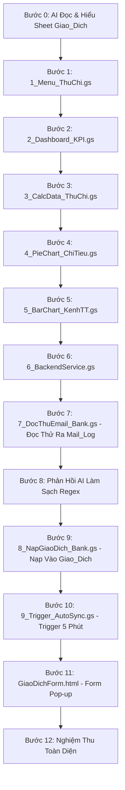

# KẾ HOẠCH THỰC HÀNH CHUẨN BÀI 6: HỆ THỐNG QUẢN LÝ SỔ QUỸ THU CHI, TỰ ĐỘNG ĐỒNG BỘ GMAIL & DASHBOARD DÒNG TIỀN
## KIẾN TRÚC VI BƯỚC ĐỘC LẬP (1 BƯỚC = 1 FILE / 1 THAO TÁC DUY NHẤT)

> **Triết lý thực hành:** Dựa trên file dữ liệu `bai6.xlsx` (trang `Giao_Dich`), học viên sẽ xây dựng một ứng dụng Quản lý Sổ Quỹ Thu Chi, Tự động quét Gmail ngân hàng (qua bước đọc thử `Mail_Log`, tinh chỉnh phản hồi AI và nạp chính thức) & Dashboard Dòng Tiền hoàn chỉnh.

---

## 📂 SƠ ĐỒ CÁC FILE ĐỘC LẬP TRONG DỰ ÁN

```
📁 Thu Chi & Cashflow Management System
├── 📜 1_Menu_ThuChi.gs      (Bước 1: Menu tiện ích trên thanh công cụ & Tích hợp Đồng bộ Gmail)
├── 📜 2_Dashboard_KPI.gs   (Bước 2: Khởi tạo Dashboard & 4 thẻ KPI Thu/Chi/Số Dư)
├── 📜 3_CalcData_ThuChi.gs (Bước 3: Bảng phụ Calc_Data tính toán gom nhóm)
├── 📜 4_PieChart_ChiTieu.gs(Bước 4: Vẽ biểu đồ tròn cơ cấu chi tiêu theo nhóm)
├── 📜 5_BarChart_KenhTT.gs (Bước 5: Vẽ biểu đồ cột chi tiêu theo kênh thanh toán)
├── 📜 6_BackendService.gs  (Bước 6: Backend xử lý thêm giao dịch thủ công, tính VAT & ghi log)
├── 📜 7_DocThuEmail_Bank.gs(Bước 7: Đọc thử email BIDV & trích xuất ra sheet "Mail_Log")
├── 💬 Prompt Phản Hồi AI   (Bước 8: Phản hồi kết quả thực tế để AI sửa & làm sạch Regex 100%)
├── 📜 8_NapGiaoDich_Bank.gs(Bước 9: Nạp chuẩn 12 cột vào sheet "Giao_Dich" & cập nhật Dashboard)
├── 📜 9_Trigger_AutoSync.gs(Bước 10: Cài đặt Time-driven Trigger chạy ngầm mỗi 5 phút)
└── 🌐 GiaoDichForm.html    (Bước 11: Form Pop-up Nhập giao dịch thủ công Aesthetic Blue)
```

---

## 🔄 LỘ TRÌNH 12 VI BƯỚC THỰC HÀNH CHI TIẾT



---

### 🧠 BƯỚC 0: YÊU CẦU AI TỰ ĐỌC & NẮM RÕ SHEET `Giao_Dich`

* **Câu Prompt Bước 0:**

```text
Link Google Sheets: [Dán đường link bảng tính của bạn vào đây]

Tôi đang có một file bảng tính quản lý giao dịch thu chi "Giao_Dich" ở đường link trên.
Nhiệm vụ của bạn ở bước này:
1. Hãy truy cập vào link bảng tính và đọc kỹ trang tính "Giao_Dich".
2. Nắm rõ: tên các cột dữ liệu (từ Cột A đến Cột L), dòng tiêu đề (Dòng 2), dòng bắt đầu có dữ liệu thực tế (Dòng 3) và các loại giao dịch (Thu / Chi).
3. Tóm tắt ngắn gọn lại những gì bạn đã đọc được để tôi biết bạn đã hiểu đúng cấu trúc dữ liệu.

⚠️ Lưu ý: Chưa viết bất kỳ dòng code nào ở bước này.
```

---

### 🚀 BƯỚC 1: TẠO MENU QUẢN LÝ THU CHI TRÊN GOOGLE SHEETS

* **Thao tác:** Mở Apps Script ➔ Bấm dấu `+` ➔ chọn **Script** ➔ Đặt tên file là `1_Menu_ThuChi.gs`.
* **Câu Prompt Bước 1:**

```text
[TIÊU CHUẨN KỸ THUẬT]: Bạn là Chuyên gia Google Apps Script. Hãy tuân thủ nghiêm ngặt toàn bộ nguyên tắc trong tài liệu "QUY_TAC_SINH_CODE_APPS_SCRIPT_AI.md" đính kèm.

[YÊU CẦU NGHIỆP VỤ - TẠO MENU QUẢN LÝ THU CHI]:
Dựa vào bảng tính thu chi đã phân tích ở trên, hãy viết hàm onOpen() để tự động tạo một Menu tên là "Quản Lý Thu Chi" trên thanh công cụ Google Sheets với các mục sau:

1. Dashboard Sổ Quỹ
2. Đọc Thử Email Ra Bảng Mail_Log (kiểm tra trước khi nạp)
3. Nạp Giao Dịch Vào Sổ Quỹ Giao_Dich
4. Bật Tự Động Quét Email (Mỗi 5 Phút)
5. Tắt Tự Động Quét Email
6. Nhập Giao Dịch Thu Chi Thủ Công
7. Hướng Dẫn Sử Dụng

[YÊU CẦU ĐẦU RA]:
- Xuất khối mã Apps Script hoàn chỉnh, có bọc khối kiểm tra an toàn (nếu chức năng nào đang trong quá trình thiết lập thì hiện thông báo nhắc nhở, không để báo lỗi đỏ).
```

---

### 📊 BƯỚC 2: TẠO TRANG DASHBOARD & 4 THẺ TỔNG QUAN THU CHI

* **Thao tác:** Mở Apps Script ➔ Bấm dấu `+` ➔ chọn **Script** ➔ Đặt tên file là `2_Dashboard_KPI.gs`.
* **Câu Prompt Bước 2:**

```text
[TIÊU CHUẨN KỸ THUẬT]: Bạn là Chuyên gia Google Apps Script. Hãy tuân thủ nghiêm ngặt toàn bộ nguyên tắc trong tài liệu "QUY_TAC_SINH_CODE_APPS_SCRIPT_AI.md" đính kèm.

[YÊU CẦU NGHIỆP VỤ - THIẾT LẬP DASHBOARD SỔ QUỸ]:
Hãy viết toàn bộ mã nguồn cho file độc lập "2_Dashboard_KPI.gs" để xây dựng giao diện Dashboard và cơ chế tự động cập nhật:

1. Khởi tạo trang tính tên là "Dashboard Sổ Quỹ" nằm ở vị trí đầu tiên (nếu đã có trang này thì làm sạch nội dung cũ để tạo mới).
2. Thiết kế Banner tiêu đề:
   - Dòng 1: Tiêu đề nổi bật "SỔ QUỸ THU CHI & QUẢN TRỊ DÒNG TIỀN 2026" (nền xanh navy đậm #0f4c81, chữ trắng in đậm).
   - Dòng 3: Hiển thị ngày giờ cập nhật dữ liệu tự động.
3. Thiết kế 4 ô thông tin tổng quan (từ Hàng 5 đến Hàng 7):
   - Tổng Thu: Tính tổng cột "Tổng Sau Thuế" của các khoản "Thu" từ bảng Giao_Dich (định dạng tiền tệ VNĐ).
   - Tổng Chi: Tính tổng cột "Tổng Sau Thuế" của các khoản "Chi" từ bảng Giao_Dich (định dạng tiền tệ VNĐ).
   - Số Dư Quỹ Thực Tế: Lấy Tổng Thu trừ Tổng Chi (định dạng tiền tệ VNĐ).
   - Tỷ Lệ Chi / Thu: Tính tỷ lệ % giữa Tổng Chi trên Tổng Thu (định dạng 0.0%).
4. Lắng nghe thay đổi thời gian thực: Tích hợp hàm onEdit(e) an toàn để khi người dùng sửa hoặc thêm dòng trực tiếp ở sheet "Giao_Dich", Dashboard tự động tính toán lại và nhảy số tức thì.

[YÊU CẦU ĐẦU RA]:
- Xuất khối mã Apps Script hoàn chỉnh, có hàm điều phối tự động kết nối các biểu đồ khi các bước sau hoàn thành.
```

---

### 📈 BƯỚC 3: TẠO BẢNG PHỤ GOM NHÓM SỐ LIỆU BIỂU ĐỒ

* **Thao tác:** Mở Apps Script ➔ Bấm dấu `+` ➔ chọn **Script** ➔ Đặt tên file là `3_CalcData_ThuChi.gs`.
* **Câu Prompt Bước 3:**

```text
[TIÊU CHUẨN KỸ THUẬT]: Bạn là Chuyên gia Google Apps Script. Hãy tuân thủ nghiêm ngặt toàn bộ nguyên tắc trong tài liệu "QUY_TAC_SINH_CODE_APPS_SCRIPT_AI.md" đính kèm.

[YÊU CẦU NGHIỆP VỤ - TẠO BẢNG TÍNH PHỤ CHO BIỂU ĐỒ]:
Hãy viết mã Apps Script tạo trang tính phụ tên là "Calc_Data" để tổng hợp số liệu nguồn cho biểu đồ:

1. Bảng tổng hợp theo Nhóm chi tiêu (bắt đầu từ cột A, dòng 1):
   - Tiêu đề: "Nhóm Chi Tiêu" và "Tổng Chi Sau Thuế".
   - Liệt kê 8 nhóm: Ăn uống, Đi lại, Nhà ở, Mua sắm, Y tế, Học tập, Giải trí, Khác.
   - Dùng c### 📊 BƯỚC 5: TỰ ĐỘNG VẼ BIỂU ĐỒ CỘT KÊNH THANH TOÁN

* **Thao tác:** Mở Apps Script ➔ Bấm dấu `+` ➔ chọn **Script** ➔ Đặt tên file là `5_BarChart_KenhTT.gs`.
* **Câu Prompt Bước 5:**

```text
[TIÊU CHUẨN KỸ THUẬT]: Bạn là Chuyên gia Google Apps Script. Hãy tuân thủ nghiêm ngặt toàn bộ nguyên tắc trong tài liệu "QUY_TAC_SINH_CODE_APPS_SCRIPT_AI.md" đính kèm.

[YÊU CẦU NGHIỆP VỤ - FILE 5_BarChart_KenhTT.gs]:
Hãy viết mã cho file độc lập "5_BarChart_KenhTT.gs" để vẽ Biểu đồ cột phân tích Kênh thanh toán:

1. Nguồn dữ liệu: Lấy từ bảng phụ Kênh thanh toán trên trang Calc_Data (từ dòng 1).
2. Vị trí đặt: Hàng 9 Cột E trên Dashboard (song song bên phải Biểu đồ tròn, kích thước 560px x 360px).
3. Cấu hình biểu đồ:
   - Dùng .asColumnChart(), .setNumHeaders(1), .setOption("useFirstColumnAsDomain", true).
   - Tiêu đề: "CHI TIÊU THEO KÊNH THANH TOÁN" (màu xanh navy hiện đại).

[YÊU CẦU ĐẦU RA]:
- Xuất 1 khối mã hoàn chỉnh cho file "5_BarChart_KenhTT.gs", tự động xóa biểu đồ cũ cùng loại trước khi vẽ mới.`
```

---

### ⚙️ BƯỚC 6: TẠO FILE 6_BackendService.gs (CHỨC NĂNG LƯU GIAO DỊCH THỦ CÔNG)

* **Thao tác:** Mở Apps Script ➔ Bấm dấu `+` ➔ chọn **Script** ➔ Đặt tên file là `6_BackendService.gs`.
* **Câu Prompt Bước 6:**

```text
[TIÊU CHUẨN KỸ THUẬT]: Bạn là Chuyên gia Google Apps Script. Hãy tuân thủ nghiêm ngặt toàn bộ nguyên tắc trong tài liệu "QUY_TAC_SINH_CODE_APPS_SCRIPT_AI.md" đính kèm.

[YÊU CẦU NGHIỆP VỤ - FILE 6_BackendService.gs]:
Hãy viết mã cho file độc lập "6_BackendService.gs" để xử lý việc lưu một giao dịch mới vào sổ quỹ:

1. Tiếp nhận dữ liệu giao dịch từ biểu mẫu: Ngày, Tháng/Năm, Loại, Nhóm chi tiêu, Mô tả, Người liên quan, Kênh thanh toán, Số tiền, VAT (%), Trạng thái, Ghi chú.
2. Tự động tính: Tổng Sau Thuế = Số tiền * (1 + VAT).
3. Chèn 1 dòng mới vào cuối bảng "Giao_Dich" với đúng 12 cột (A đến L).
4. Tự động cập nhật lại Dashboard ngay sau khi lưu thành công.

[YÊU CẦU ĐẦU RA]:
- Xuất khối mã hoàn chỉnh cho file "6_BackendService.gs", có phản hồi kết quả thành công để thông báo cho người dùng.
```

---

### 📨 BƯỚC 7: TẠO FILE 0_GuiEmailGiaLap_Bank.gs (MÃ NGUỒN CÓ SẴN - GỬI 3 EMAIL TEST)

* **Thao tác:** Mở Apps Script ➔ Bấm dấu `+` ➔ chọn **Script** ➔ Đặt tên file là `0_GuiEmailGiaLap_Bank.gs` ➔ **Sao chép trực tiếp mã nguồn có sẵn bên dưới** và bấm Chạy hàm `guiBoEmailBienLaiMauDeTest` (Không cần prompt AI):

```javascript
/**
 * ==============================================================================
 * CÔNG CỤ HỖ TRỢ TEST: GIẢ LẬP GỬI EMAIL BIÊN LAI NGÂN HÀNG (MOCK SENDER)
 * File: 0_GuiEmailGiaLap_Bank.gs
 * Chức năng: Gửi email biên lai chuyển tiền chuẩn định dạng HTML (BIDV/Vietcombank)
 *            đến hòm thư Gmail của bạn để kiểm thử bóc tách tự động.
 * ==============================================================================
 */

function guiBoEmailBienLaiMauDeTest() {
  try {
    var emailNhan = Session.getActiveUser().getEmail();
    if (!emailNhan) emailNhan = "diepdailehoai@gmail.com";

    Logger.log("Bắt đầu gửi email test đến: " + emailNhan);

    // 1. Chi Ăn uống (Phúc Long Coffee & Tea)
    guiEmailBienLaiBIDV({
      emailNhan: emailNhan,
      maGD: "18492015839",
      loaiGD: "Chi",
      soTien: "185,000 VND",
      doiTac: "PHUC LONG COFFEE & TEA",
      kenhTT: "Chuyển khoản (BIDV)",
      noiDung: "Thanh toan tien tra sua va cafe buoi chieu phong kinh doanh"
    });

    // 2. Thu Hoàn tiền Cashback (BIDV)
    guiEmailBienLaiBIDV({
      emailNhan: emailNhan,
      maGD: "19582014632",
      loaiGD: "Thu",
      soTien: "320,000 VND",
      doiTac: "NGAN HANG BIDV",
      kenhTT: "Thẻ ngân hàng (BIDV)",
      noiDung: "Hoan tien cashback giao dich the thang 08"
    });

    // 3. Chi Đi lại (Xăng dầu Petrolimex)
    guiEmailBienLaiBIDV({
      emailNhan: emailNhan,
      maGD: "17892014821",
      loaiGD: "Chi",
      soTien: "500,000 VND",
      doiTac: "PETROLIMEX CUA HANG XANG DAU SO 12",
      kenhTT: "Chuyển khoản (BIDV)",
      noiDung: "Do xang xe oto cong tac tuan 3"
    });

    SpreadsheetApp.flush();
    var thongBao = "ĐÃ GỬI THÀNH CÔNG 3 EMAIL BIÊN LAI MẪU!\n\nEmail được gửi đến: " + emailNhan;
    Logger.log(thongBao);
    SpreadsheetApp.getUi().alert("GỬI EMAIL TEST THÀNH CÔNG", thongBao, SpreadsheetApp.getUi().ButtonSet.OK);
  } catch (err) {
    Logger.log("Lỗi khi gửi email test: " + err.toString());
  }
}

function guiEmailBienLaiBIDV(params) {
  var nowStr = Utilities.formatDate(new Date(), "GMT+7", "HH:mm") + " Thứ " + Utilities.formatDate(new Date(), "GMT+7", "dd/MM/yyyy");
  var isThu = (params.loaiGD === "Thu");
  var subject = "BIDV Biên lai chuyển tiền qua tài khoản - Lệnh GD " + params.maGD;

  var htmlBody = 
    '<div style="font-family: Arial, sans-serif; max-width: 600px; margin: 20px auto; border: 1px solid #e0e0e0; border-radius: 8px; overflow: hidden;">' +
      '<div style="background-color: #ffffff; padding: 20px; text-align: center; border-bottom: 2px solid #008744;">' +
        '<h2 style="color: #0f4c81; margin: 0; font-size: 20px;">NGÂN HÀNG <span style="color: #fbbc04;">BIDV</span></h2>' +
        '<h3 style="color: #333333; margin: 8px 0 4px; font-size: 15px;">BIÊN LAI CHUYỂN TIỀN QUA TÀI KHOẢN</h3>' +
        '<p style="color: #666666; margin: 0; font-size: 12px;">(Loại giao dịch: ' + (isThu ? "Nhận tiền / Thu" : "Chuyển tiền / Chi") + ')</p>' +
      '</div>' +
      '<table style="width: 100%; border-collapse: collapse; font-size: 13px; color: #202124;">' +
        '<tr style="border-bottom: 1px solid #f1f3f4;"><td style="padding: 12px 20px; font-weight: bold; width: 40%;">Ngày, giờ giao dịch</td><td style="padding: 12px 20px;">' + nowStr + '</td></tr>' +
        '<tr style="border-bottom: 1px solid #f1f3f4;"><td style="padding: 12px 20px; font-weight: bold;">Số lệnh giao dịch</td><td style="padding: 12px 20px; font-weight: bold; color: #0f4c81;">' + params.maGD + '</td></tr>' +
        '<tr style="border-bottom: 1px solid #f1f3f4;"><td style="padding: 12px 20px; font-weight: bold;">Loại giao dịch</td><td style="padding: 12px 20px; font-weight: bold; color: ' + (isThu ? "#137333" : "#c5221f") + ';">' + (isThu ? "Thu" : "Chi") + '</td></tr>' +
        '<tr style="border-bottom: 1px solid #f1f3f4;"><td style="padding: 12px 20px; font-weight: bold;">' + (isThu ? "Người chuyển tiền" : "Tên người nhận tiền") + '</td><td style="padding: 12px 20px;">' + params.doiTac + '</td></tr>' +
        '<tr style="border-bottom: 1px solid #f1f3f4;"><td style="padding: 12px 20px; font-weight: bold;">Kênh thanh toán</td><td style="padding: 12px 20px;">' + params.kenhTT + '</td></tr>' +
        '<tr style="border-bottom: 1px solid #f1f3f4; background-color: #f8fdf9;"><td style="padding: 14px 20px; font-weight: bold; color: #137333;">Số tiền</td><td style="padding: 14px 20px; font-weight: bold; color: #137333; font-size: 16px;">' + params.soTien + '</td></tr>' +
        '<tr style="border-bottom: 1px solid #f1f3f4;"><td style="padding: 12px 20px; font-weight: bold;">Nội dung chuyển tiền</td><td style="padding: 12px 20px;">' + params.noiDung + '</td></tr>' +
      '</table>' +
      '<div style="background-color: #f8f9fa; padding: 15px; text-align: center; font-size: 11px; color: #70757a; border-top: 1px solid #e0e0e0;">' +
        '<p style="margin: 0;">Email biên lai giao dịch tự động phục vụ mục đích kiểm thử hệ thống sổ quỹ.</p>' +
      '</div>' +
    '</div>';

  GmailApp.sendEmail(params.emailNhan, subject, "", { htmlBody: htmlBody });
}
```

---

### 🔍 BƯỚC 8: TẠO FILE test.gs (ĐỌC TIÊU ĐỀ & NỘI DUNG EMAIL RA SHEET TEST)

* **Thao tác:** Mở Apps Script ➔ Bấm dấu `+` ➔ chọn **Script** ➔ Đặt tên file là `test.gs`.
* **Câu Prompt Bước 8:**

```text
[TIÊU CHUẨN KỸ THUẬT]: Bạn là Chuyên gia Google Apps Script. Hãy tuân thủ nghiêm ngặt toàn bộ nguyên tắc trong tài liệu "QUY_TAC_SINH_CODE_APPS_SCRIPT_AI.md" đính kèm.

[YÊU CẦU NGHIỆP VỤ - FILE test.gs]:
Hãy viết mã cho file độc lập "test.gs" để đọc thử các email ngân hàng:

1. Tìm các email có tiêu đề chứa "BIDV" hoặc "Biên lai chuyển tiền" trong Gmail.
2. Lấy 2 thông tin chính:
   - Tiêu đề email
   - Toàn bộ nội dung thư (Plain Body)
3. Tạo trang tính "Test_Email_Raw" và đổ danh sách email đọc được vào bảng để người dùng xem trực tiếp nội dung thư.

[YÊU CẦU ĐẦU RA]:
- Xuất 1 khối mã Apps Script hoàn chỉnh, có thông báo số lượng email đã đọc.
```

---

### 📊 BƯỚC 9: TẠO FILE 7_DocThuEmail_Bank.gs (BÓC TÁCH DỮ LIỆU RA BẢNG MAIL_LOG)

* **Thao tác:** Mở Apps Script ➔ Bấm dấu `+` ➔ chọn **Script** ➔ Đặt tên file là `7_DocThuEmail_Bank.gs`.
* **Câu Prompt Bước 9:**

```text
[TIÊU CHUẨN KỸ THUẬT]: Bạn là Chuyên gia Google Apps Script. Hãy tuân thủ nghiêm ngặt toàn bộ nguyên tắc trong tài liệu "QUY_TAC_SINH_CODE_APPS_SCRIPT_AI.md" đính kèm.

[YÊU CẦU NGHIỆP VỤ - FILE 7_DocThuEmail_Bank.gs]:
Dựa vào nội dung các email ngân hàng đang có ở trang tính "Test_Email_Raw":

Hãy viết mã cho file độc lập "7_DocThuEmail_Bank.gs" để bóc tách thông tin từ các email đó và xuất kết quả ra trang tính "Mail_Log" gồm đúng các cột sau:
1. STT
2. Ngày GD (DD/MM/YYYY)
3. Tháng/Năm (MM/YYYY)
4. Mã GD (Số lệnh giao dịch)
5. Loại GD (Thu / Chi)
6. Nhóm Chi Tiêu (Tự động nhận diện: Ăn uống, Đi lại, Mua sắm, Nhà ở, Khác...)
7. Mô Tả (Nội dung chuyển tiền)
8. Người Liên Quan (Đối tác nhận hoặc chuyển)
9. Kênh Thanh Toán
10. Số Tiền (Định dạng VNĐ)
11. VAT (%) (Mặc định 0.00%)
12. Tổng Sau Thuế (Số Tiền * (1 + VAT), định dạng VNĐ)
13. Trạng Thái Nạp (Mặc định là "Chưa nạp")
14. Ghi Chú

[YÊU CẦU ĐẦU RA]:
- Xuất 1 khối mã Apps Script hoàn chỉnh, có thông báo số lượng email đã bóc tách thành công.
```

---

### 📥 BƯỚC 10: TẠO FILE 8_NapGiaoDich_Bank.gs (NẠP EMAIL VÀO SỔ QUỸ & NHẢY DASHBOARD)

* **Thao tác:** Mở Apps Script ➔ Bấm dấu `+` ➔ chọn **Script** ➔ Đặt tên file là `8_NapGiaoDich_Bank.gs`.
* **Câu Prompt Bước 10:**

```text
[TIÊU CHUẨN KỸ THUẬT]: Bạn là Chuyên gia Google Apps Script. Hãy tuân thủ nghiêm ngặt toàn bộ nguyên tắc trong tài liệu "QUY_TAC_SINH_CODE_APPS_SCRIPT_AI.md" đính kèm.

[YÊU CẦU NGHIỆP VỤ - FILE 8_NapGiaoDich_Bank.gs]:
Hãy viết mã cho file độc lập "8_NapGiaoDich_Bank.gs" để chuyển dữ liệu từ bảng "Mail_Log" sang bảng chính "Giao_Dich":

1. Tìm các dòng có "Trạng Thái Nạp" là "Chưa nạp" trong bảng "Mail_Log".
2. Chép toàn bộ thông tin sang cuối bảng "Giao_Dich" với đúng thứ tự 12 cột (A đến L):
   - Cột A: Ngày GD
   - Cột B: Tháng/Năm
   - Cột C: Loại GD (Thu / Chi)
   - Cột D: Nhóm Chi Tiêu
   - Cột E: Mô Tả
   - Cột F: Người Liên Quan
   - Cột G: Kênh Thanh Toán
   - Cột H: Số Tiền
   - Cột I: VAT (%)
   - Cột J: Tổng Sau Thuế
   - Cột K: Trạng Thái ("Đã thu" nếu là Thu, "Đã chi" nếu là Chi)
   - Cột L: Ghi Chú ("Số lệnh: " + Mã GD)
3. Chống nạp trùng: Kiểm tra nếu Mã GD đã tồn tại ở cột Ghi Chú trên bảng Giao_Dich thì bỏ qua không nạp lại.
4. Cập nhật đồng bộ: Đổi trạng thái trên Mail_Log thành "Đã nạp" và tự động làm mới Dashboard cùng 2 biểu đồ ngay sau khi nạp.

[YÊU CẦU ĐẦU RA]:
- Xuất 1 khối mã Apps Script hoàn chỉnh, có thông báo số lượng giao dịch đã nạp thành công.
```

---

### ⏰ BƯỚC 11: TẠO FILE 9_Trigger_AutoSync.gs (CÀI ĐẶT TỰ ĐỘNG QUÉT EMAIL MỖI 5 PHÚT)

* **Thao tác:** Mở Apps Script ➔ Bấm dấu `+` ➔ chọn **Script** ➔ Đặt tên file là `9_Trigger_AutoSync.gs`.
* **Câu Prompt Bước 11:**

```text
[TIÊU CHUẨN KỸ THUẬT]: Bạn là Chuyên gia Google Apps Script. Hãy tuân thủ nghiêm ngặt toàn bộ nguyên tắc trong tài liệu "QUY_TAC_SINH_CODE_APPS_SCRIPT_AI.md" đính kèm.

[YÊU CẦU NGHIỆP VỤ - FILE 9_Trigger_AutoSync.gs]:
Hãy viết mã cho file độc lập "9_Trigger_AutoSync.gs" để quản lý việc tự động chạy ngầm theo thời gian:

1. Chức năng bật tự động:
   - Tự động kích hoạt hàm nạp giao dịch chạy ngầm định kỳ mỗi 5 phút một lần (Time-driven Trigger).
   - Xóa các lịch cũ trùng lặp trước khi tạo lịch mới để tránh chạy đúp.
   - Hiển thị thông báo xác nhận đã kích hoạt tự động hóa thành công.
2. Chức năng tắt tự động:
   - Tìm và xóa bỏ toàn bộ lịch chạy ngầm khi người dùng muốn tạm dừng.

[YÊU CẦU ĐẦU RA]:
- Xuất khối mã hoàn chỉnh cho file "9_Trigger_AutoSync.gs", an toàn và dễ sử dụng.
```

---

### 📋 BƯỚC 12: TẠO FILE GiaoDichForm.html (GIAO DIỆN POP-UP NHẬP NHANH THU CHI)

* **Thao tác:** Mở Apps Script ➔ Bấm dấu `+` ➔ chọn **HTML** ➔ Đặt tên file là `GiaoDichForm.html`.
* **Câu Prompt Bước 12:**

```text
[YÊU CẦU THIẾT KẾ - TỆP GIAO DIỆN GiaoDichForm.html]:
Hãy thiết kế mã nguồn giao diện HTML cho file "GiaoDichForm.html" để người dùng nhập nhanh giao dịch:

1. Phong cách thiết kế:
   - Giao diện hiện đại, trực quan, bo góc trang nhã, phông chữ dễ đọc.
2. Các trường nhập liệu thông minh:
   - Ngày phát sinh (mặc định là hôm nay) và Tháng/Năm.
   - Loại giao dịch: Chọn "Thu" hoặc "Chi".
   - Nhóm chi tiêu: Danh sách chọn 8 nhóm (Ăn uống, Đi lại, Nhà ở, Mua sắm, Y tế, Học tập, Giải trí, Khác).
   - Mô tả giao dịch và Người liên quan.
   - Kênh thanh toán: Tiền mặt, Chuyển khoản, Ví điện tử, Thẻ ngân hàng.
   - Số tiền, Tùy chọn thuế VAT (0%, 8%, 10%) và Ô Tổng sau thuế (tự động tính ngay khi nhập tiền).
   - Trạng thái và Ghi chú thêm.
3. Nút "Lưu Giao Dịch": Kết nối trực tiếp với file 6_BackendService.gs để ghi vào bảng Giao_Dich và cập nhật lại Dashboard.

[YÊU CẦU ĐẦU RA]:
- Xuất trọn vẹn mã HTML/CSS/JavaScript hoàn chỉnh cho file "GiaoDichForm.html".
```

---

### ✅ BƯỚC 13: NGHIỆM THU TOÀN DIỆN HỆ THỐNG

1. Tải lại trang Google Sheets (F5).
2. Menu **`💰 Quản Lý Thu Chi`** hiển thị đầy đủ các chức năng.
3. Chạy thử **`0_GuiEmailGiaLap_Bank.gs`** để gửi 3 email biên lai mẫu vào Gmail.
4. Bấm **`🔍 1. Đọc Thử Email Ra Sheet Mail_Log`** ➔ Mở tab `Mail_Log` kiểm tra kết quả bóc tách 14 cột.
5. Bấm **`📥 2. Nạp Chính Thức Vào Sổ Quỹ Giao_Dich`** ➔ Dòng mới được thêm vào cuối sheet `Giao_Dich`, Dashboard nhảy số tức thì.
6. Bấm **`⏰ 3. Bật Tự Động Quét Gmail (Mỗi 5 Phút)`** ➔ Hệ thống tự động chạy ngầm 24/7.
7. Mở **`➕ Nhập Giao Dịch Thủ Công`** ➔ Nhập thử khoản chi tiền mặt ➔ Kiểm tra Dashboard cập nhật!
