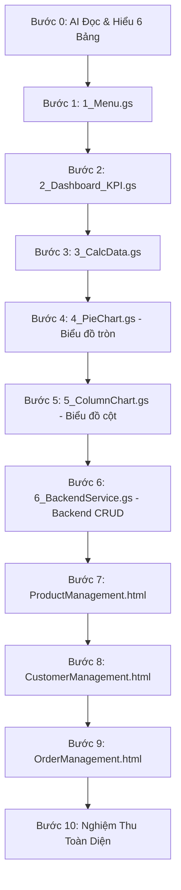

# KẾ HOẠCH THỰC HÀNH CHUẨN BÀI 7: HỆ THỐNG QUẢN LÝ BÁN HÀNG & DASHBOARD PRO
## KIẾN TRÚC VI BƯỚC ĐỘC LẬP (1 BƯỚC = 1 FILE DUY NHẤT)

> **Mô hình 1 Vi Bước = 1 File Độc Lập:** Mỗi bước học viên chỉ cần tạo đúng **1 file duy nhất** và chạy thử nghiệm thu ngay lập tức. Tách biệt hoàn toàn từ Menu, Dashboard, Từng biểu đồ cho đến từng giao diện HTML riêng biệt!

---

## 📂 SƠ ĐỒ TOÀN BỘ CÁC FILE ĐỘC LẬP TRONG DỰ ÁN

```
📁 Tech Hub Store System
├── 📜 1_Menu.gs               (Bước 1: Menu tiện ích trên thanh công cụ)
├── 📜 2_Dashboard_KPI.gs      (Bước 2: Khởi tạo Dashboard & 4 thẻ KPI)
├── 📜 3_CalcData.gs           (Bước 3: Lập bảng tính toán phụ Calc_Data)
├── 📜 4_PieChart.gs           (Bước 4: Tự động vẽ Biểu đồ tròn Danh mục)
├── 📜 5_ColumnChart.gs        (Bước 5: Tự động vẽ Biểu đồ cột Top 10 Sản phẩm)
├── 📜 6_BackendService.gs     (Bước 6: CRUD Sản phẩm, Khách hàng, Đơn hàng & Trừ kho)
├── 🌐 ProductManagement.html  (Bước 7: Giao diện Quản lý Sản phẩm)
├── 🌐 CustomerManagement.html (Bước 8: Giao diện Quản lý Khách hàng)
└── 🌐 OrderManagement.html    (Bước 9: Giao diện Tạo & Quản lý Đơn hàng)
```

---

## 🔄 LỘ TRÌNH 10 VI BƯỚC THỰC HÀNH CHI TIẾT



---

### 🧠 BƯỚC 0: YÊU CẦU AI TỰ ĐỌC & NẮM RÕ BẢNG TÍNH

* **Mục tiêu:** Gửi link Google Sheets để AI tự động quét cấu trúc 6 bảng trước khi bắt đầu.
* **Câu Prompt Bước 0:**

```text
Link Google Sheets: [Dán đường link bảng tính của bạn vào đây]

Tôi đang có một file bảng tính quản lý bán hàng "Tech Hub Store" ở đường link trên.
Nhiệm vụ của bạn ở bước này:
1. Hãy truy cập vào link bảng tính và đọc kỹ toàn bộ các trang tính (sheet) hiện có.
2. Nắm rõ: tên từng sheet, các cột dữ liệu, dòng bắt đầu có dữ liệu thực tế và mối liên hệ giữa các bảng.
3. Tóm tắt ngắn gọn lại những gì bạn đã đọc được để tôi biết bạn đã hiểu đúng cấu trúc dữ liệu.

⚠️ Lưu ý: Chưa viết bất kỳ dòng code nào ở bước này.
```

---

### 🚀 BƯỚC 1: TẠO FILE `1_Menu.gs` (MENU TIỆN ÍCH TRÊN THANH CÔNG CỤ)

* **Thao tác:** Bấm dấu `+` ➔ chọn **Script** ➔ Đặt tên file là `1_Menu.gs`.
* **Câu Prompt Bước 1:**

```text
QUY TẮC BẮT BUỘC KHI SINH CODE APPS SCRIPT: (đính kèm file QUY_TAC_SINH_CODE_APPS_SCRIPT_AI.md)

Dựa trên bảng tính đã đọc ở Bước 0, hãy viết mã cho file độc lập "1_Menu.gs" để tạo thanh Menu tiện ích khi tôi mở Google Sheets:

1. Tạo Menu tên là "🏪 Tech Hub Store" gồm các mục sau:
   - "📊 Dashboard Tổng Quan" (gọi hàm moDashboardTongQuan)
   - [Đường gạch ngang phân cách]
   - "🛍️ Quản Lý Sản Phẩm" (gọi hàm moGiaoDienSanPham)
   - "👥 Quản Lý Khách Hàng" (gọi hàm moGiaoDienKhachHang)
   - "📦 Quản Lý Đơn Hàng" (gọi hàm moGiaoDienDonHang)
   - [Đường gạch ngang phân cách]
   - "🔄 Làm Mới Dashboard" (gọi hàm khoiTaoDashboard)
   - "❓ Hướng Dẫn Sử Dụng" (hiện bảng thông báo hướng dẫn sơ lược cách dùng)

2. Kích thước các cửa sổ popup khi mở ra:
   - Cửa sổ Sản phẩm: rộng 920px, cao 660px, mở file 'ProductManagement'.
   - Cửa sổ Khách hàng: rộng 920px, cao 660px, mở file 'CustomerManagement'.
   - Cửa sổ Đơn hàng: rộng 1020px, cao 720px, mở file 'OrderManagement'.
   - Bọc mã an toàn: nếu hàm khoiTaoDashboard chưa có thì hiện thông báo nhắc nhở nhẹ nhàng.
```

---

### 📊 BƯỚC 2: TẠO FILE `2_Dashboard_KPI.gs` (BANNER HEADER & 4 THẺ KPI)

* **Thao tác:** Bấm dấu `+` ➔ chọn **Script** ➔ Đặt tên file là `2_Dashboard_KPI.gs`.
* **Câu Prompt Bước 2:**

```text
QUY TẮC BẮT BUỘC KHI SINH CODE APPS SCRIPT: (đính kèm file QUY_TAC_SINH_CODE_APPS_SCRIPT_AI.md)

Hãy viết toàn bộ mã nguồn cho file độc lập "2_Dashboard_KPI.gs" chứa hàm thietLapGiaoDienDashboard() và hàm điều phối khoiTaoDashboard():

1. Khởi tạo trang "📊 Dashboard":
   - Tự động tạo mới trang "📊 Dashboard" ở vị trí đầu tiên (nếu đã có thì xóa sạch bảng biểu, biểu đồ cũ và hủy gộp ô cũ để làm mới).
   - Hàng 1: Dòng tiêu đề lớn "🏪 TECH HUB STORE - DASHBOARD QUẢN LÝ" (nền xanh dương đậm #0f4c81, chữ trắng in đậm cỡ 18).
   - Hàng 3: Dòng hiển thị ngày giờ cập nhật dữ liệu tự động.

2. Thiết kế 4 ô thông tin nổi bật (KPI) từ Hàng 5 đến Hàng 7 (dùng dải ô mở tính từ dòng 4 trở đi):
   - 💰 TỔNG DOANH THU (cột A-B): Tính tổng cột Thành tiền từ trang DonHang_BT7 (định dạng 'VNĐ').
   - 📦 TỔNG ĐƠN HÀNG (cột C-D): Đếm tổng số lượng mã đơn hàng từ trang DonHang_BT7 (định dạng 'đơn').
   - 👥 TỔNG KHÁCH HÀNG (cột E-F): Đếm tổng số lượng khách hàng từ trang KhachHang_BT7 (định dạng 'khách').
   - ⚠️ CẢNH BÁO TỒN KHO (cột G-H): Đếm số sản phẩm có lượng tồn kho hiện tại nhỏ hơn lượng tồn tối thiểu trong trang SanPham_BT7 (định dạng 'sản phẩm').

3. Hàm điều phối khoiTaoDashboard():
   - Tự động gọi thietLapGiaoDienDashboard().
   - Kiểm tra và tự động gọi tiếp các hàm: thietLapTrangCalcData() (ở file 3_CalcData.gs), veBieuDoTron() (ở file 4_PieChart.gs), veBieuDoCot() (ở file 5_ColumnChart.gs) nếu các hàm này đã tồn tại.

* Nghiệm thu Bước 2: Bấm "📊 Dashboard Tổng Quan", trang "📊 Dashboard" xuất hiện với 4 thẻ KPI nhảy đúng số liệu!
```

---

### 📈 BƯỚC 3: TẠO FILE `3_CalcData.gs` (BẢNG TÍNH TOÁN PHỤ CHO BIỂU ĐỒ)

* **Thao tác:** Bấm dấu `+` ➔ chọn **Script** ➔ Đặt tên file là `3_CalcData.gs`.
* **Câu Prompt Bước 3:**

```text
QUY TẮC BẮT BUỘC KHI SINH CODE APPS SCRIPT: (đính kèm file QUY_TAC_SINH_CODE_APPS_SCRIPT_AI.md)

Hãy viết toàn bộ mã nguồn cho file độc lập "3_CalcData.gs" chứa hàm thietLapTrangCalcData(sheet) để tính toán số liệu nguồn cho biểu đồ:

1. Xử lý trang tính phụ "Calc_Data" (để trang này hiển thị bình thường, TUYỆT ĐỐI KHÔNG ẨN TAB):
   - Bảng 1 (bắt đầu từ ô A1:B1 không gộp ô): Dòng 1 là tiêu đề ['Tên Danh Mục', 'Doanh Thu']. Từ dòng 2 trở đi, nạp danh sách 7 danh mục từ DanhMuc_BT7 và công thức tính tổng doanh thu tương ứng từ ChiTietDonHang_BT7 (định dạng số '#,##0').
   - Bảng 2 (bắt đầu từ ô D1:E1 không gộp ô): Điền công thức QUERY tự động lọc Top 10 sản phẩm bán chạy nhất (Tên sản phẩm và Số lượng bán) từ ChiTietDonHang_BT7.

* Nghiệm thu Bước 3: Mở tab "Calc_Data" thấy xuất hiện 2 bảng số liệu sạch sẽ bắt đầu từ dòng 1.
```

---

### 🥧 BƯỚC 4: TẠO FILE `4_PieChart.gs` (VẼ BIỂU ĐỒ TRÒN - TỶ LỆ DOANH THU)

* **Thao tác:** Bấm dấu `+` ➔ chọn **Script** ➔ Đặt tên file là `4_PieChart.gs`.
* **Câu Prompt Bước 4:**

```text
QUY TẮC BẮT BUỘC KHI SINH CODE APPS SCRIPT: (đính kèm file QUY_TAC_SINH_CODE_APPS_SCRIPT_AI.md)

Hãy viết toàn bộ mã nguồn cho file độc lập "4_PieChart.gs" chứa hàm veBieuDoTron(dashSheet, calcSheet) để vẽ Biểu đồ tròn:

1. Thiết lập Biểu đồ tròn (Charts.ChartType.PIE):
   - Lấy nguồn dữ liệu từ bảng Danh mục trên trang Calc_Data (dải ô A1:B8), có khai báo .setNumHeaders(1).
   - Đặt biểu đồ tại Hàng 9 Cột A trên trang "📊 Dashboard" (kích thước khoảng 490px rộng, 360px cao).
   - Tiêu đề biểu đồ: "📊 TỶ LỆ DOANH THU THEO DANH MỤC", chữ in đậm màu xanh #0f4c81.
   - Hiển thị rõ tỷ lệ phần trăm (percentage) trên từng lát cắt và có chú thích danh mục rõ ràng bên phải.

* Nghiệm thu Bước 4: Bấm "🔄 Làm Mới Dashboard", Biểu đồ tròn xuất hiện ngay ngắn bên dưới thẻ KPI Doanh thu và Đơn hàng!
```

---

### 📊 BƯỚC 5: TẠO FILE `5_ColumnChart.gs` (VẼ BIỂU ĐỒ CỘT - TOP 10 SẢN PHẨM)

* **Thao tác:** Bấm dấu `+` ➔ chọn **Script** ➔ Đặt tên file là `5_ColumnChart.gs`.
* **Câu Prompt Bước 5:**

```text
QUY TẮC BẮT BUỘC KHI SINH CODE APPS SCRIPT: (đính kèm file QUY_TAC_SINH_CODE_APPS_SCRIPT_AI.md)

Hãy viết toàn bộ mã nguồn cho file độc lập "5_ColumnChart.gs" chứa hàm veBieuDoCot(dashSheet, calcSheet) để vẽ Biểu đồ cột:

1. Thiết lập Biểu đồ cột (Charts.ChartType.COLUMN):
   - Lấy nguồn dữ liệu từ bảng Top 10 trên trang Calc_Data (dải ô D1:E11), có khai báo .setNumHeaders(1).
   - Đặt biểu đồ tại Hàng 9 Cột E trên trang "📊 Dashboard" (nằm song song bên phải Biểu đồ tròn, kích thước khoảng 560px rộng, 360px cao).
   - Tiêu đề biểu đồ: "🏆 TOP 10 SẢN PHẨM BÁN CHẠY NHẤT", cột màu xanh dương #1a73e8.
   - Nhãn tên sản phẩm ở trục hoành xoay nghiêng 30 độ để không bị đè chữ.

* Nghiệm thu Bước 5: Bấm "🔄 Làm Mới Dashboard", cả 2 Biểu đồ tròn và cột hiển thị song song tuyệt đẹp bên dưới 4 thẻ KPI!
```

---

### ⚙️ BƯỚC 6: TẠO FILE `6_BackendService.gs` (CRUD & TỰ ĐỘNG TRỪ KHO)

* **Thao tác:** Bấm dấu `+` ➔ chọn **Script** ➔ Đặt tên file là `6_BackendService.gs`.
* **Câu Prompt Bước 6:**

```text
QUY TẮC BẮT BUỘC KHI SINH CODE APPS SCRIPT: (đính kèm file QUY_TAC_SINH_CODE_APPS_SCRIPT_AI.md)

Hãy viết toàn bộ mã nguồn cho file độc lập "6_BackendService.gs" để xử lý các nghiệp vụ bán hàng kết nối với bảng tính:

1. Quản lý Sản phẩm (trang SanPham_BT7):
   - getProducts(page, search, category): đọc danh sách sản phẩm hiển thị 10 dòng/trang, có tìm kiếm.
   - saveProduct(productData): thêm mới (tự sinh mã SP067) hoặc cập nhật sản phẩm cũ.
   - deleteProduct(productId): kiểm tra nếu sản phẩm đã bán trong ChiTietDonHang_BT7 thì không cho xóa.

2. Quản lý Khách hàng (trang KhachHang_BT7):
   - getCustomers(page, search, type): đọc danh sách khách hàng phân trang 10 dòng.
   - saveCustomer(customerData): thêm mới (tự sinh mã KH031) hoặc cập nhật khách hàng.
   - deleteCustomer(customerId): xóa khách hàng.

3. Xử lý Đơn hàng & Tự động trừ kho:
   - getOrderFormData(): lấy danh sách khách hàng và sản phẩm còn tồn kho.
   - createOrder(orderHeader, orderItems):
     a. Tự sinh mã đơn mới (DH-031) và lưu vào DonHang_BT7.
     b. Lưu chi tiết từng món vào ChiTietDonHang_BT7.
     c. TỰ ĐỘNG TRỪ KHO: Giảm tồn kho tại cột F sheet SanPham_BT7.
     d. GHI NHẬT KÝ KHO: Thêm 1 dòng log xuất bán vào LichSuTonKho_BT7.
     e. Tự động đồng bộ số liệu trên Dashboard.
```

---

### 🛍️ BƯỚC 7: TẠO FILE `ProductManagement.html` (GIAO DIỆN QUẢN LÝ SẢN PHẨM)

* **Thao tác:** Bấm dấu `+` ➔ chọn **HTML** ➔ Đặt tên file là `ProductManagement.html`.
* **Câu Prompt Bước 7:**

```text
Hãy thiết kế mã nguồn cho tệp giao diện "ProductManagement.html" kết nối với file 6_BackendService.gs:

1. Giao diện & Thư viện:
   - Sử dụng Bootstrap 5 và FontAwesome (qua CDN), tông màu Aesthetic Blue sang trọng, bo góc 12px, font Inter.
2. Chức năng chính:
   - Thanh công cụ phía trên: Ô tìm kiếm nhanh sản phẩm theo tên hoặc mã, bộ lọc theo danh mục, nút "➕ Thêm Sản Phẩm Mới".
   - Bảng danh sách sản phẩm: Hiển thị 10 dòng mỗi trang, có phân trang (Trang trước, Trang sau), mỗi dòng có nút Sửa (icon bút vàng) và nút Xóa (icon thùng rác đỏ).
   - Popup Modal Thêm/Sửa: Biểu mẫu nhập Tên SP, Danh mục (dropdown), Đơn vị tính, Giá bán, Tồn kho tối thiểu.
   - Kết nối hai chiều với các hàm getProducts, saveProduct, deleteProduct trong 6_BackendService.gs.

* Nghiệm thu Bước 7: Mở Menu "🛍️ Quản Lý Sản Phẩm" ➔ Cửa sổ danh sách sản phẩm hiện lên mượt mà, thử tìm kiếm và thêm sản phẩm mới thành công!
```

---

### 👥 BƯỚC 8: TẠO FILE `CustomerManagement.html` (GIAO DIỆN QUẢN LÝ KHÁCH HÀNG)

* **Thao tác:** Bấm dấu `+` ➔ chọn **HTML** ➔ Đặt tên file là `CustomerManagement.html`.
* **Câu Prompt Bước 8:**

```text
Hãy thiết kế mã nguồn cho tệp giao diện "CustomerManagement.html" kết nối với file 6_BackendService.gs:

1. Giao diện & Thư viện:
   - Sử dụng Bootstrap 5 và FontAwesome, tông màu Aesthetic Blue sang trọng đồng bộ hệ thống.
2. Chức năng chính:
   - Thanh công cụ: Ô tìm kiếm khách hàng (theo tên hoặc số điện thoại), bộ lọc phân loại (Tất cả / VIP / Thường), nút "➕ Thêm Khách Hàng".
   - Bảng danh sách khách hàng: Hiển thị 10 dòng/trang, có phân trang, huy hiệu (badge) nổi bật cho khách VIP (màu tím/vàng), nút Sửa và Xóa.
   - Popup Modal Thêm/Sửa: Nhập Tên, SĐT, Email, Địa chỉ, Tỉnh/Thành phố, Phân hạng thành viên.
   - Kết nối với các hàm getCustomers, saveCustomer, deleteCustomer trong 6_BackendService.gs.

* Nghiệm thu Bước 8: Mở Menu "👥 Quản Lý Khách Hàng" ➔ Cửa sổ khách hàng hiện lên, thử lọc khách VIP và thêm khách hàng mới thành công!
```

---

### 📦 BƯỚC 9: TẠO FILE `OrderManagement.html` (GIAO DIỆN TẠO & QUẢN LÝ ĐƠN HÀNG)

* **Thao tác:** Bấm dấu `+` ➔ chọn **HTML** ➔ Đặt tên file là `OrderManagement.html`.
* **Câu Prompt Bước 9:**

```text
Hãy thiết kế mã nguồn cho tệp giao diện "OrderManagement.html" kết nối với file 6_BackendService.gs:

1. Giao diện & Thư viện:
   - Sử dụng Bootstrap 5 và FontAwesome, tông màu Aesthetic Blue, kích thước chuẩn rộng 1020px x cao 720px.
2. Chức năng màn hình Lập Đơn Hàng Thông Minh:
   - Phần 1 (Thông tin chung): Dropdown chọn Khách hàng (tự động điền SĐT và địa chỉ), ngày đặt hàng, trạng thái đơn.
   - Phần 2 (Chọn mặt hàng): Dropdown chọn Sản phẩm (hiển thị rõ số lượng tồn kho còn lại và giá bán), ô nhập Số lượng, nút "➕ Thêm Vào Giỏ".
   - Phần 3 (Bảng giỏ hàng tạm thời): Hiển thị các món vừa thêm, có cột Đơn giá, Thành tiền, nút Xóa từng dòng khỏi giỏ, ô Tổng tiền đơn hàng tự động cộng dồn.
   - Nút "🚀 Hoàn Tất & Xuất Đơn": Gửi dữ liệu về hàm createOrder trong 6_BackendService.gs để lưu vào Google Sheets và tự động trừ tồn kho.

* Nghiệm thu Bước 9: Mở Menu "📦 Quản Lý Đơn Hàng" ➔ Lập thử 1 đơn hàng đa sản phẩm ➔ Bấm Hoàn tất thấy báo thành công và tồn kho tự động trừ!
```

---

### ✅ BƯỚC 10: NGHIỆM THU HOÀN THÀNH TOÀN DIỆN HỆ THỐNG

1. Tải lại trang Google Sheets (F5).
2. Menu **`🏪 Tech Hub Store`** hiển thị đầy đủ trên thanh công cụ.
3. Bấm **`📊 Dashboard Tổng Quan`** ➔ Xem Banner, 4 thẻ KPI và cả 2 Biểu đồ (tròn & cột) hoạt động mượt mà.
4. Mở **`🛍️ Quản Lý Sản Phẩm`** ➔ Thêm thử 1 sản phẩm mới.
5. Mở **`👥 Quản Lý Khách Hàng`** ➔ Thêm thử 1 khách hàng mới.
6. Mở **`📦 Quản Lý Đơn Hàng`** ➔ Đặt thử 1 đơn hàng mới và kiểm tra:
   - Đơn mới xuất hiện ở `DonHang_BT7`.
   - Tồn kho tự động trừ ở `SanPham_BT7`.
   - Log tự động ghi ở `LichSuTonKho_BT7`.
   - Dashboard tự động nhảy tăng doanh thu và đơn hàng theo thời gian thực!
