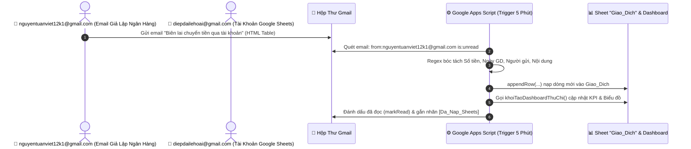

# 🚀 HƯỚNG DẪN GIẢ LẬP EMAIL NGÂN HÀNG & TỰ ĐỘNG NẠP VÀO GOOGLE SHEETS (BÀI 6)

Tài liệu này cung cấp giải pháp trọn gói từ **A đến Z**:
1. **Kịch bản thực hiện**: Sử dụng `nguyentuanviet12k1@gmail.com` (đóng vai trò Ngân hàng BIDV / Vietcombank) gửi email biên lai giao dịch sang `diepdailehoai@gmail.com`.
2. **Bộ mã gửi email giả lập (Mock Sender)**: Tạo email có giao diện bảng HTML biên lai chuẩn 100% như ảnh mẫu.
3. **Bộ mã nhận & bóc tách dữ liệu (Gmail Scanner Engine)**: Tự động lọc email, trích xuất chính xác 12 trường dữ liệu bằng Regex.
4. **Cài đặt Trigger tự động mỗi 5 phút**: Hệ thống tự động chạy ngầm, không cần mở Google Sheets.

---

## 🎯 1. KỊCH BẢN TỔNG QUAN HỆ THỐNG



---

## 📧 2. MẪU EMAIL BIÊN LAI GIẢ LẬP (HTML & TEXT)

Dưới đây là mẫu nội dung biên lai mô phỏng chuẩn xác từng trường dữ liệu như hình ảnh thực tế:

* **Tiêu đề email (Subject):** `[BIDV/VCB] Biên lai chuyển tiền qua tài khoản - Lệnh GD 15668595287`
* **Nội dung HTML hiển thị:**

```html
<div style="font-family: Arial, sans-serif; max-width: 600px; margin: auto; border: 1px solid #e0e0e0; padding: 20px; border-radius: 8px;">
  <div style="text-align: center; border-bottom: 2px solid #008744; padding-bottom: 10px;">
    <h2 style="color: #008744; margin: 0;">Vietcombank / BIDV</h2>
    <h3 style="margin: 8px 0 2px 0; color: #333;">Biên lai chuyển tiền qua tài khoản</h3>
    <p style="margin: 0; color: #666; font-size: 13px;">(Payment Receipt)</p>
  </div>
  
  <table style="width: 100%; border-collapse: collapse; margin-top: 15px; font-size: 14px;">
    <tr style="border-bottom: 1px solid #eee;">
      <td style="padding: 10px; font-weight: bold; width: 45%;">Ngày, giờ giao dịch<br><span style="font-size: 12px; color: #777; font-weight: normal;">Trans. Date, Time</span></td>
      <td style="padding: 10px;">14:02 Thứ Năm 20/08/2026</td>
    </tr>
    <tr style="border-bottom: 1px solid #eee;">
      <td style="padding: 10px; font-weight: bold;">Số lệnh giao dịch<br><span style="font-size: 12px; color: #777; font-weight: normal;">Order Number</span></td>
      <td style="padding: 10px;">15668595287</td>
    </tr>
    <tr style="border-bottom: 1px solid #eee;">
      <td style="padding: 10px; font-weight: bold;">Tài khoản nguồn<br><span style="font-size: 12px; color: #777; font-weight: normal;">Debit Account</span></td>
      <td style="padding: 10px;">0281000305318</td>
    </tr>
    <tr style="border-bottom: 1px solid #eee;">
      <td style="padding: 10px; font-weight: bold;">Tên người chuyển tiền<br><span style="font-size: 12px; color: #777; font-weight: normal;">Remitter's name</span></td>
      <td style="padding: 10px;">TRAN THU MAI</td>
    </tr>
    <tr style="border-bottom: 1px solid #eee;">
      <td style="padding: 10px; font-weight: bold;">Tài khoản người hưởng<br><span style="font-size: 12px; color: #777; font-weight: normal;">Credit Account</span></td>
      <td style="padding: 10px;">0281000558520</td>
    </tr>
    <tr style="border-bottom: 1px solid #eee;">
      <td style="padding: 10px; font-weight: bold;">Tên người hưởng<br><span style="font-size: 12px; color: #777; font-weight: normal;">Beneficiary Name</span></td>
      <td style="padding: 10px;">NGUYEN THI BAO VY</td>
    </tr>
    <tr style="border-bottom: 1px solid #eee;">
      <td style="padding: 10px; font-weight: bold;">Tên ngân hàng hưởng<br><span style="font-size: 12px; color: #777; font-weight: normal;">Beneficiary Bank Name</span></td>
      <td style="padding: 10px;">Vietcombank / BIDV</td>
    </tr>
    <tr style="border-bottom: 1px solid #eee; background-color: #f9fbf9;">
      <td style="padding: 10px; font-weight: bold; color: #008744;">Số tiền<br><span style="font-size: 12px; color: #777; font-weight: normal;">Amount</span></td>
      <td style="padding: 10px; font-weight: bold; color: #008744; font-size: 16px;">1,000,000 VND</td>
    </tr>
    <tr style="border-bottom: 1px solid #eee;">
      <td style="padding: 10px; font-weight: bold;">Nội dung chuyển tiền<br><span style="font-size: 12px; color: #777; font-weight: normal;">Details of Payment</span></td>
      <td style="padding: 10px;">TRAN THU MAI chuyen tien</td>
    </tr>
  </table>
  
  <div style="text-align: center; margin-top: 20px; color: #666; font-size: 12px;">
    <p><b>Cảm ơn Quý khách đã sử dụng dịch vụ!</b></p>
  </div>
</div>
```

---

## 🛠️ 3. MÃ NGUỒN APPS SCRIPT TRÊN TÀI KHOẢN `diepdailehoai@gmail.com`

Mở file Google Sheets chứa trang `Giao_Dich` ➔ Chọn **Tiện ích mở rộng** ➔ **Apps Script**. Tạo 2 file độc lập sau:

### 📜 File 1: `7_GmailSync_Bank.gs` (Bóc Tách & Nạp Vào Google Sheets)

```javascript
/**
 * ==============================================================================
 * MODULE TỰ ĐỘNG QUÉT EMAIL BIÊN LAI NGÂN HÀNG & NẠP VÀO SHEET GIAO_DICH
 * ==============================================================================
 */

function quetEmailBienDongSoDu() {
  var ss = SpreadsheetApp.getActiveSpreadsheet();
  var sheet = ss.getSheetByName("Giao_Dich");
  if (!sheet) {
    Logger.log("Lỗi: Không tìm thấy trang tính Giao_Dich");
    return;
  }

  // 1. Quản lý Nhãn (Label) để chống nạp trùng lặp
  var labelName = "Da_Nap_Sheets";
  var label = GmailApp.getUserLabelByName(labelName) || GmailApp.createLabel(labelName);

  // 2. Bộ lọc tìm kiếm email từ nguyentuanviet12k1@gmail.com hoặc có từ khóa biên lai chưa đọc
  // Cú pháp tìm kiếm chính xác:
  var query = 'from:nguyentuanviet12k1@gmail.com is:unread -label:' + labelName;
  var threads = GmailApp.search(query, 0, 10);

  var demGiaoDich = 0;

  for (var i = 0; i < threads.length; i++) {
    var messages = threads[i].getMessages();
    for (var j = 0; j < messages.length; j++) {
      var msg = messages[j];
      
      if (msg.isUnread()) {
        var bodyText = msg.getPlainBody();
        var bodyHtml = msg.getBody();
        var subject = msg.getSubject();
        var dateReceived = msg.getDate();

        // 3. Gọi hàm bóc tách dữ liệu chuyên sâu theo mẫu biên lai ngân hàng
        var info = bocTachBienLaiNganHang(subject, bodyText, bodyHtml, dateReceived);

        if (info && info.soTien > 0) {
          // 4. Chuẩn bị 1 dòng gồm 12 cột khớp hoàn toàn với bảng Giao_Dich (Cột A đến L)
          var newRow = [
            info.ngayGD,        // Cột A: Ngày GD (dd/MM/yyyy)
            info.thangNam,      // Cột B: Tháng/Năm (MM/yyyy)
            info.loaiGD,        // Cột C: Loại GD (Thu / Chi)
            info.nhomChiTieu,   // Cột D: Nhóm Chi Tiêu
            info.moTa,          // Cột E: Mô Tả
            info.nguoiLienQuan, // Cột F: Người Liên Quan
            info.kenhTT,        // Cột G: Kênh Thanh Toán (Chuyển khoản)
            info.soTien,        // Cột H: Số Tiền
            0,                  // Cột I: VAT (0%)
            info.soTien,        // Cột J: Tổng Sau Thuế
            info.loaiGD === "Thu" ? "Đã thu" : "Đã chi", // Cột K: Trạng Thái
            "Biên lai GD: " + info.maGD + " [Từ " + info.nguoiGuiEmail + "]" // Cột L: Ghi Chú
          ];

          sheet.appendRow(newRow);
          demGiaoDich++;
        }

        // Đánh dấu đã đọc
        msg.markRead();
      }
    }
    // Gắn nhãn để lần quét sau bỏ qua không bị trùng lặp
    threads[i].addLabel(label);
  }

  // 5. Nếu có giao dịch mới, làm mới Dashboard ngay lập tức
  if (demGiaoDich > 0) {
    SpreadsheetApp.flush();
    if (typeof khoiTaoDashboardThuChi === 'function') {
      khoiTaoDashboardThuChi();
    }
    Logger.log("✅ Đã nạp thành công " + demGiaoDich + " giao dịch vào Google Sheets!");
  } else {
    Logger.log("ℹ️ Không có email biên lai mới nào cần xử lý.");
  }
}

/**
 * Hàm phân tích & bóc tách thông tin biên lai (Hỗ trợ cấu trúc Bảng & Regex Text)
 */
function bocTachBienLaiNganHang(subject, bodyText, bodyHtml, dateObj) {
  var content = bodyText + " " + bodyHtml;

  // 1. Ngày & Tháng Năm GD (mặc định lấy theo thời gian nhận mail, hoặc trích xuất từ nội dung)
  var ngayGD = Utilities.formatDate(dateObj, "GMT+7", "dd/MM/yyyy");
  var thangNam = Utilities.formatDate(dateObj, "GMT+7", "MM/yyyy");

  var dateMatch = content.match(/(\d{2}\/\d{2}\/\d{4})/);
  if (dateMatch) {
    ngayGD = dateMatch[1];
    var parts = ngayGD.split('/');
    if (parts.length === 3) thangNam = parts[1] + "/" + parts[2];
  }

  // 2. Trích xuất Số Tiền (Amount)
  var soTien = 0;
  var moneyMatch = content.match(/Số tiền[^:]*?[:\n\r<>\/td]+([0-9,.]+)\s*(?:VND|VNĐ|d|đ)?/i)
                || content.match(/([0-9]{1,3}(?:[.,][0-9]{3})+)\s*(?:VND|VNĐ|d|đ)/i);
  if (moneyMatch && moneyMatch[1]) {
    var raw = moneyMatch[1].replace(/[.,](?=[0-9]{3})/g, '').replace(',', '.');
    soTien = Math.abs(parseFloat(raw)) || 0;
  }

  // 3. Trích xuất Người Chuyển Tiền (Remitter's Name)
  var nguoiLienQuan = "TRAN THU MAI";
  var remitterMatch = content.match(/Tên người chuyển tiền[^:]*?[:\n\r<>\/td]+([^<\n\r]+)/i);
  if (remitterMatch && remitterMatch[1]) {
    nguoiLienQuan = remitterMatch[1].replace(/<[^>]+>/g, '').trim();
  }

  // 4. Trích xuất Nội Dung Chuyển Tiền (Details of Payment)
  var moTa = "Chuyển tiền qua tài khoản";
  var ndMatch = content.match(/Nội dung chuyển tiền[^:]*?[:\n\r<>\/td]+([^<\n\r]+)/i);
  if (ndMatch && ndMatch[1]) {
    moTa = ndMatch[1].replace(/<[^>]+>/g, '').trim();
  }

  // 5. Trích xuất Mã / Số Lệnh Giao Dịch
  var maGD = "---";
  var orderMatch = content.match(/Số lệnh giao dịch[^:]*?[:\n\r<>\/td]+([0-9a-zA-Z]+)/i);
  if (orderMatch && orderMatch[1]) {
    maGD = orderMatch[1].trim();
  }

  // 6. Nhận diện Thu/Chi (Người nhận diepdailehoai là người hưởng -> Thu)
  var loaiGD = "Thu"; // Mặc định nhận tiền là Thu

  // 7. Phân loại nhóm chi tiêu/thu nhập
  var nhomChiTieu = "Khác";
  var moTaLower = moTa.toLowerCase();
  if (moTaLower.indexOf("an") >= 0 || moTaLower.indexOf("cafe") >= 0) nhomChiTieu = "Ăn uống";
  else if (moTaLower.indexOf("luong") >= 0) nhomChiTieu = "Khác";
  else if (moTaLower.indexOf("shopee") >= 0 || moTaLower.indexOf("mua") >= 0) nhomChiTieu = "Mua sắm";

  return {
    ngayGD: ngayGD,
    thangNam: thangNam,
    loaiGD: loaiGD,
    nhomChiTieu: nhomChiTieu,
    moTa: moTa,
    nguoiLienQuan: nguoiLienQuan,
    kenhTT: "Chuyển khoản",
    soTien: soTien,
    maGD: maGD,
    nguoiGuiEmail: "nguyentuanviet12k1@gmail.com"
  };
}
```

---

### 📜 File 2: `8_Trigger_AutoSync.gs` (Cài Đặt Trigger Quét Định Kỳ Mỗi 5 Phút)

```javascript
/**
 * ==============================================================================
 * MODULE THIẾT LẬP TIME-DRIVEN TRIGGER CHẠY NGẦM MỖI 5 PHÚT
 * ==============================================================================
 */

function caiDatTriggerQuetGmail() {
  // Xóa trigger cũ để tránh kích hoạt trùng lặp
  huyTriggerQuetGmail();

  // Tạo Trigger ngầm chạy hàm 'quetEmailBienDongSoDu' mỗi 5 phút
  ScriptApp.newTrigger('quetEmailBienDongSoDu')
    .timeBased()
    .everyMinutes(5)
    .create();

  SpreadsheetApp.getUi().alert(
    '⏰ ĐÃ BẬT TỰ ĐỘNG HÓA THÀNH CÔNG',
    'Hệ thống sẽ tự động quét email từ nguyentuanviet12k1@gmail.com mỗi 5 phút.\\n\\nMọi biên lai mới sẽ được bóc tách và tự động điền vào sheet Giao_Dich!',
    SpreadsheetApp.getUi().ButtonSet.OK
  );
}

function huyTriggerQuetGmail() {
  var triggers = ScriptApp.getProjectTriggers();
  for (var i = 0; i < triggers.length; i++) {
    if (triggers[i].getHandlerFunction() === 'quetEmailBienDongSoDu') {
      ScriptApp.deleteTrigger(triggers[i]);
    }
  }
}
```

---

## 🧪 4. HÀM TEST GIẢ LẬP GỬI EMAIL TỰ ĐỘNG TỪ `nguyentuanviet12k1@gmail.com`

Nếu bạn muốn tài khoản `nguyentuanviet12k1@gmail.com` tự động bắn 5 email biên lai chuẩn sang `diepdailehoai@gmail.com` (gồm cả Thu và Chi) để test hệ thống, hãy chạy đoạn mã sau trên tài khoản người gửi:

```javascript
function gui5EmailBienLaiThuChi() {
  var emailNhan = "diepdailehoai@gmail.com";
  
  var danhSachBienLai = [
    {
      nganHang: "BIDV",
      maGD: "15668595287",
      ngayGio: "08:30 Thứ Hai 05/01/2026",
      loaiGD: "Thu",
      mauSac: "#008744",
      soTien: "15,000,000 VND",
      nguoiGui: "CONG TY CONG NGHE ABC",
      nguoiNhan: "HOANG NGOC DIEP",
      kenhTT: "Chuyển khoản (BIDV)",
      nhomChiTieu: "Khác",
      noiDung: "Nhan tien luong thang 01/2026",
      trangThai: "Đã thu"
    },
    {
      nganHang: "Vietcombank",
      maGD: "16047281935",
      ngayGio: "12:15 Thứ Tư 07/01/2026",
      loaiGD: "Chi",
      mauSac: "#c5221f",
      soTien: "1,250,000 VND",
      nguoiGui: "HOANG NGOC DIEP",
      nguoiNhan: "NHA HANG SEN TAY HO",
      kenhTT: "Chuyển khoản (Vietcombank)",
      nhomChiTieu: "Ăn uống",
      noiDung: "Thanh toan tien an tiec nha hang Sen Tay Ho",
      trangThai: "Đã chi"
    },
    {
      nganHang: "Techcombank",
      maGD: "17892014821",
      ngayGio: "15:45 Thứ Bảy 10/01/2026",
      loaiGD: "Chi",
      mauSac: "#c5221f",
      soTien: "418,000 VND",
      nguoiGui: "HOANG NGOC DIEP",
      nguoiNhan: "CONG TY DIEN LUC",
      kenhTT: "Chuyển khoản (Techcombank)",
      nhomChiTieu: "Nhà ở",
      noiDung: "Thanh toan tien dien sinh hoat thang 01",
      trangThai: "Đã chi"
    },
    {
      nganHang: "BIDV",
      maGD: "18920147510",
      ngayGio: "19:20 Thứ Hai 12/01/2026",
      loaiGD: "Chi",
      mauSac: "#c5221f",
      soTien: "918,000 VND",
      nguoiGui: "HOANG NGOC DIEP",
      nguoiNhan: "SIEU THI VINMART",
      kenhTT: "Chuyển khoản (BIDV)",
      nhomChiTieu: "Mua sắm",
      noiDung: "Thanh toan tien mua sam sieu thi Vinmart",
      trangThai: "Đã chi"
    },
    {
      nganHang: "BIDV",
      maGD: "19582014632",
      ngayGio: "10:10 Thứ Năm 15/01/2026",
      loaiGD: "Thu",
      mauSac: "#008744",
      soTien: "320,000 VND",
      nguoiGui: "NGAN HANG BIDV",
      nguoiNhan: "HOANG NGOC DIEP",
      kenhTT: "Thẻ ngân hàng (BIDV)",
      nhomChiTieu: "Khác",
      noiDung: "Hoan tien cashback giao dich the",
      trangThai: "Đã thu"
    }
  ];

  for (var i = 0; i < danhSachBienLai.length; i++) {
    var item = danhSachBienLai[i];
    var tieuDe = item.nganHang + " Biên lai chuyển tiền qua tài khoản - Lệnh GD " + item.maGD;

    var htmlContent = `
      <div style="font-family: Arial, sans-serif; max-width: 600px; margin: auto; border: 1px solid #e0e0e0; padding: 20px; border-radius: 8px;">
        <div style="text-align: center; border-bottom: 2px solid ` + item.mauSac + `; padding-bottom: 10px;">
          <h2 style="color: ` + item.mauSac + `; margin: 0; font-size: 20px;">NGÂN HÀNG ` + item.nganHang.toUpperCase() + `</h2>
          <h3 style="margin: 6px 0 2px 0; color: #333; font-size: 16px;">BIÊN LAI CHUYỂN TIỀN QUA TÀI KHOẢN</h3>
          <p style="margin: 0; color: #666; font-size: 13px;">(Loại giao dịch: ` + (item.loaiGD === "Thu" ? "Nhận tiền / Thu" : "Chuyển tiền đi / Chi") + `)</p>
        </div>
        
        <table style="width: 100%; border-collapse: collapse; margin-top: 15px; font-size: 14px;">
          <tr style="border-bottom: 1px solid #eee;">
            <td style="padding: 8px; font-weight: bold; width: 45%;">Ngày, giờ giao dịch</td>
            <td style="padding: 8px;">` + item.ngayGio + `</td>
          </tr>
          <tr style="border-bottom: 1px solid #eee;">
            <td style="padding: 8px; font-weight: bold;">Số lệnh giao dịch</td>
            <td style="padding: 8px; font-weight: bold; color: ` + item.mauSac + `;">` + item.maGD + `</td>
          </tr>
          <tr style="border-bottom: 1px solid #eee;">
            <td style="padding: 8px; font-weight: bold;">Loại giao dịch</td>
            <td style="padding: 8px; font-weight: bold; color: ` + item.mauSac + `;">` + item.loaiGD + `</td>
          </tr>
          <tr style="border-bottom: 1px solid #eee;">
            <td style="padding: 8px; font-weight: bold;">Người chuyển tiền</td>
            <td style="padding: 8px;">` + item.nguoiGui + `</td>
          </tr>
          <tr style="border-bottom: 1px solid #eee;">
            <td style="padding: 8px; font-weight: bold;">Người nhận tiền</td>
            <td style="padding: 8px;">` + item.nguoiNhan + `</td>
          </tr>
          <tr style="border-bottom: 1px solid #eee;">
            <td style="padding: 8px; font-weight: bold;">Kênh thanh toán</td>
            <td style="padding: 8px;">` + item.kenhTT + `</td>
          </tr>
          <tr style="border-bottom: 1px solid #eee; background-color: ` + (item.loaiGD === "Thu" ? "#f0fdf4" : "#fef2f2") + `;">
            <td style="padding: 10px 8px; font-weight: bold; color: ` + item.mauSac + `;">Số tiền</td>
            <td style="padding: 10px 8px; font-weight: bold; color: ` + item.mauSac + `; font-size: 16px;">` + item.soTien + `</td>
          </tr>
          <tr style="border-bottom: 1px solid #eee;">
            <td style="padding: 8px; font-weight: bold;">Nội dung chuyển tiền</td>
            <td style="padding: 8px;">` + item.noiDung + `</td>
          </tr>
        </table>
      </div>
        </tr>
        <tr style="border-bottom: 1px solid #eee; background-color: #f9fbf9;">
          <td style="padding: 10px; font-weight: bold; color: #008744;">Số tiền</td>
          <td style="padding: 10px; font-weight: bold; color: #008744; font-size: 16px;">1,000,000 VND</td>
        </tr>
        <tr style="border-bottom: 1px solid #eee;">
          <td style="padding: 10px; font-weight: bold;">Nội dung chuyển tiền</td>
          <td style="padding: 10px;">TRAN THU MAI chuyen tien</td>
        </tr>
      </table>
    </div>
  `;

  GmailApp.sendEmail(emailNhan, tieuDe, "Vui lòng xem biên lai trong định dạng HTML", {
    htmlBody: htmlBody
  });
  
  Logger.log("✅ Đã gửi email biên lai giả lập sang: " + emailNhan);
}
```

---

## 📋 5. QUY TRÌNH NGHIỆM THU 4 BƯỚC

1. **Bước 1 (Gửi thư):** Dùng `nguyentuanviet12k1@gmail.com` gửi 1 email theo mẫu trên sang `diepdailehoai@gmail.com`.
2. **Bước 2 (Chạy quét thủ công):** Trên Google Sheets của `diepdailehoai@gmail.com`, bấm Menu **`💰 Quản Lý Thu Chi` ➔ `📥 Quét Email Ngân Hàng Ngay`**.
   * 👉 Kết quả: Dòng mới xuất hiện tại `Giao_Dich` với số tiền `1,000,000 VNĐ`, Loại GD: `Thu`, Người LQ: `TRAN THU MAI`.
   * 👉 Email trên Gmail tự động chuyển sang trạng thái **Đã đọc** và có nhãn **`Da_Nap_Sheets`**.
3. **Bước 3 (Bật tự động hóa):** Bấm **`⏰ Bật Tự Động Quét Gmail (Mỗi 5 Phút)`**.
4. **Bước 4 (Kiểm tra Dashboard):** Thẻ **🟢 TỔNG THU** và **🔵 SỐ DƯ QUỸ** trên trang `📊 Dashboard Sổ Quỹ` tự động tăng thêm `1,000,000 VNĐ`!
